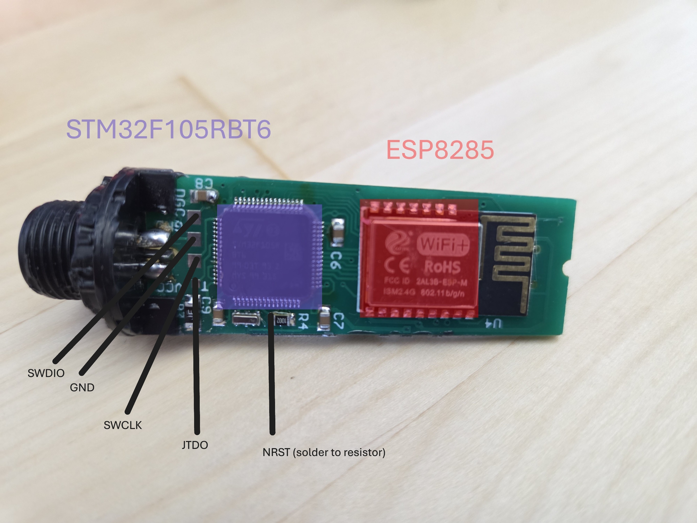
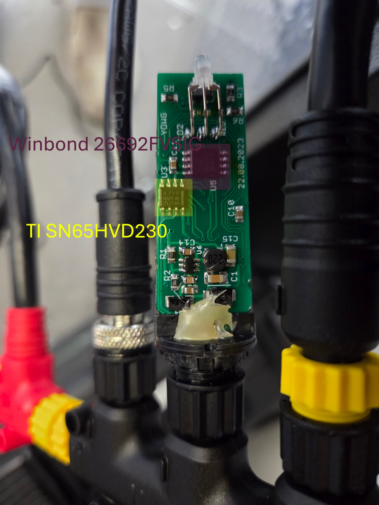
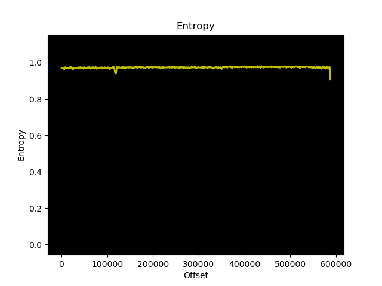
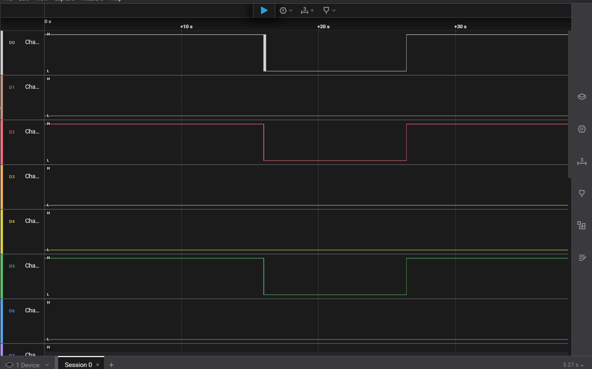
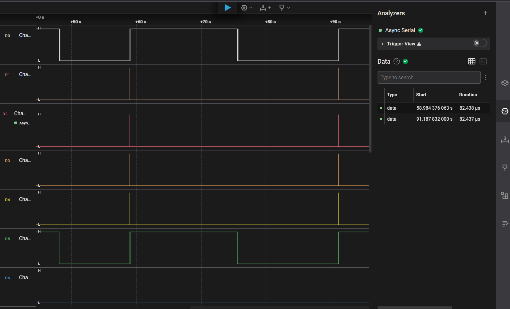
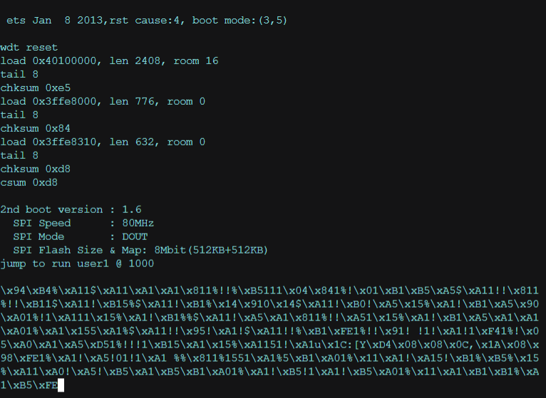
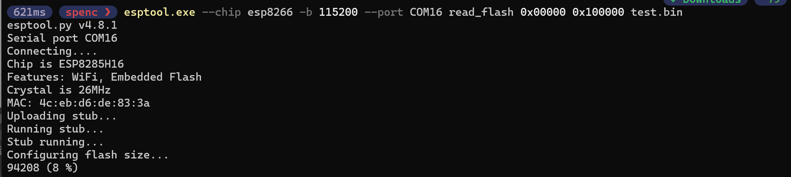

# Penetration Testing of Yacth Devices NMEA 2000 Wifi Gateway and Processes

## 1. Reconnaissance

### 1.1 Physical Hardware

Front Side 



Back Side



After taking a look at the front side of the PCB, we can see that the device is using an [STM32F105RBT6](./assets/pdfs/en.CD00220364.pdf).

### 1.2 Network Scanning

```
nmap.exe --top-ports 1000 -Pn 192.168.4.1
Starting Nmap 7.95 ( https://nmap.org ) at 2025-03-24 14:17 Mountain Daylight Time
Nmap scan report for 192.168.4.1
Host is up (0.0054s latency).
Not shown: 999 closed tcp ports (reset)
PORT   STATE SERVICE
80/tcp open  http
MAC Address: 4E:EB:D6:DE:83:3A (Unknown)

Nmap done: 1 IP address (1 host up) scanned in 13.20 seconds
```

### 1.3 Firmware Analysis

File: [WUPDATE.BIN](./assets/WUPDATE/WUPDATE.BIN)

Running binwalk gives us nothing:
```
binwalk WUPDATE.BIN

DECIMAL       HEXADECIMAL     DESCRIPTION
--------------------------------------------------------------------------------
```
Evaluating the entropy of the file:

```
binwalk -E WUPDATE.BIN

DECIMAL       HEXADECIMAL     ENTROPY
--------------------------------------------------------------------------------
0             0x0             Rising entropy edge (0.972447)
120832        0x1D800         Rising entropy edge (0.977437)
```

This means that the file is either encrypted or compressed.

Let's take a look at the strings in the file:

```
strings WUPDATE.BIN | head
YDMG
1.72
*E$F
:KYb
qo7r&
!(hY}
@hK!W
dBQ1
N}*n
-#`hq
```
And again, we get nothing, but some random gibberish, and very few strings that make sense (like the version number).

Even over the WiFi update process, the firmware still seems encrypted or compressed (see [./assets/pcap](./assets/pcap/))



### 1.3.1 Attempt at Dumping the Firmware

Unfortunately, LQFP64 line is small, and soldering 30 AWG wire to the pads is hard. After many failed attempts of JTAGulating and resoldering, I decided to check the output of the device on boot:



This proves further that JTAG must've been disabled in the firmware, as there is no TCK (yellow), TDI is pulled high (green), TDO has no output (orange), NJTRST is pulled high (red). 

> Note: TMS is absent in this capture.

Even after pulling nJTRST low, the device still doesn't output anything on TDO. This means that JTAG is disabled somehow, because I am wired directly up to the microchip:



#### Help me chatgpt!

https://chatgpt.com/share/67fefc80-0250-8009-ad0f-d14a4ab460b8

#### Good start... let's move to the ESP8285, since we know it is the chip that is used for updates, and user interaction:

Found boot logs after performing a chip off, with the following pins connected:
ESP8285 Pin | Serial Adapter
|----------------|----------------|
VCC (3.3V) | 3.3V
GND | GND
TXD | RX
RXD | TX
GPIO0 | GND (for bootloader mode)
EN (RST) | 3.3V (pulled-up)



And after that, I got to enabling the bootloader mode, and dumping the firmware:



### 1.3.2 Actually dumping the firmware

The command in the image above didn't get me far, until I did the following:

Ran this command to extract the flash instead:
```
esptool.py -p PORT -b 115200 read_flash 0 ALL flash_contents.bin
```
> https://docs.espressif.com/projects/esptool/en/latest/esp8266/esptool/basic-commands.html

A copy of the firmware is available at [./assets/flash_contents.bin](./assets/flash_contents.bin).

But that doesn't render well in ghidra, so I used the following tool to convert it to an ELF file:

```
esp2elf flash_contents.bin flash_contents.elf
```

Hell yeah! Now ghidra confirms the entry point we already figured out from using the esptool:

```
esptool image_info flash_contents.bin

esptool.py v4.8.1
File size: 2097152 (bytes)
Detected image type: ESP8266
Image version: 1
Entry point: 40100438
3 segments

Segment 1: len 0x00968 load 0x40100000 file_offs 0x00000008 [IRAM]
Segment 2: len 0x00308 load 0x3ffe8000 file_offs 0x00000978 [DRAM]
Segment 3: len 0x00278 load 0x3ffe8310 file_offs 0x00000c88 [DRAM]
Checksum: d8 (valid)
```

### 1.4 Web Application Analysis

The web application is hosted on port 80 (unencrypted HTTP). More information about the web application was found through analsyis of the firmware update mechanisms (see [./assets/pcap](./assets/pcap/) and [./assets/binwalk/_flash_contents.bin.extracted](./assets/binwalk/_flash_contents.bin.extracted)).